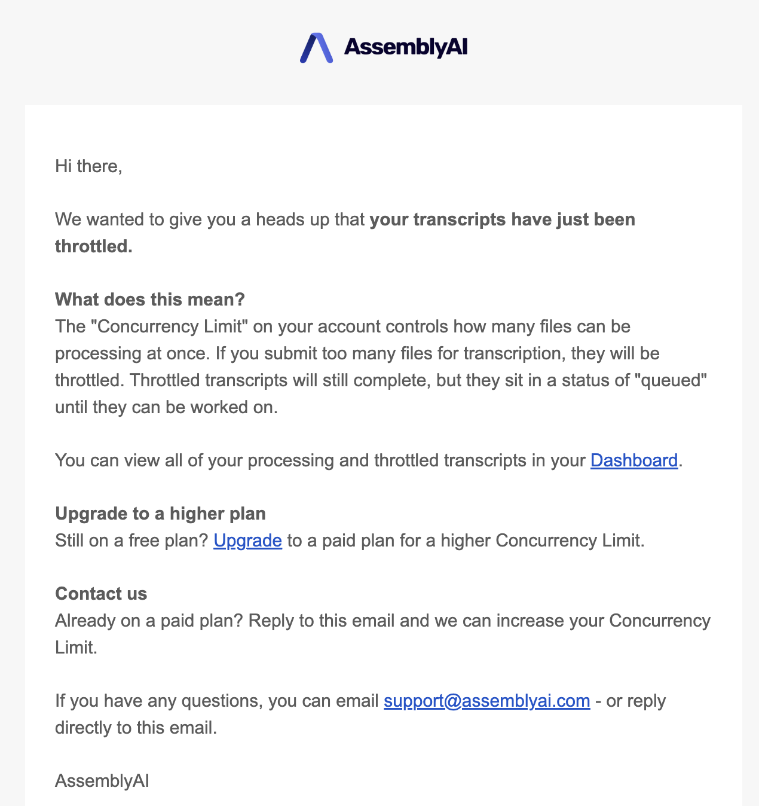

To ensure a smooth experience for all users, certain operations have per-account usage limits.

- **Concurrency limits** for asynchronous operations
- **Rate limits** for synchronous operations

<Note title="Increasing your usage limits">

The usage limits displayed on this page are default values based on your account type. If you already have a paid account and want to further increase your usage limits, <a href="https://www.assemblyai.com/contact" target="_blank">contact our Sales team</a> or send an email to our [Support team](support@assemblyai.com).

</Note>

## Speech-to-Text usage limits

AssemblyAI limits the number of transcriptions being processed at any given time.

| Usage limit | Free account | Paid account |
| --- | --- | --- |
| Concurrent transcriptions | 5 | 200 |

If you submit a transcription that would exceed your usage limit, it'll be added to a queue. Queued transcriptions will be processed automatically as previously submitted transcriptions complete.

If your account balance goes below zero, your concurrency limit will be reduced to 1.

If you exceed your concurrency limit, you'll receive an email stating that your transcripts have been throttled. Note that you'll only receive this email once per day.

## Streaming Speech-to-Text usage limits

AssemblyAI limits the number of concurrent sessions.
  
| Usage limit | Free account | Paid account |
| --- | --- | --- |
| Concurrent Streaming sessions | N/A* | 100 |

\* Streaming Speech-to-Text is only available for paid users.

<Note title="Properly terminating sessions">

If you're consistently exceeding the limit of concurrent sessions, first make sure that you're terminating sessions properly.

- If you're using the [WebSocket API](https://www.assemblyai.com/docs/api-reference/streaming/realtime) directly, you need to send a `terminate_session` message.
- If you're using one of our SDKs, see "Transcribe streaming audio from a microphone" for [Python](/docs/getting-started/transcribe-streaming-audio-from-a-microphone/python#step-6-close-the-connection), [TypeScript](//docs/getting-started/transcribe-streaming-audio-from-a-microphone/type-script#step-6-disconnect-the-real-time-service), [Go](/docs/getting-started/transcribe-streaming-audio-from-a-microphone/go#step-5-disconnect-the-transcriber), [C#](/docs/getting-started/transcribe-streaming-audio-from-a-microphone/c#step-6-disconnect-the-real-time-service), or [Java](/docs/getting-started/transcribe-streaming-audio-from-a-microphone/java).

</Note>

## LeMUR usage limits

LeMUR requests are rate limited within a 60-second time window. For more information, see [Rate limits](https://www.assemblyai.com/docs/api-reference/overview#rate-limits).

| Usage limit | Free account | Paid account |
| --- | --- | --- |
| Requests per minute | N/A* | 30 |

\* LeMUR is only available for paid users.

