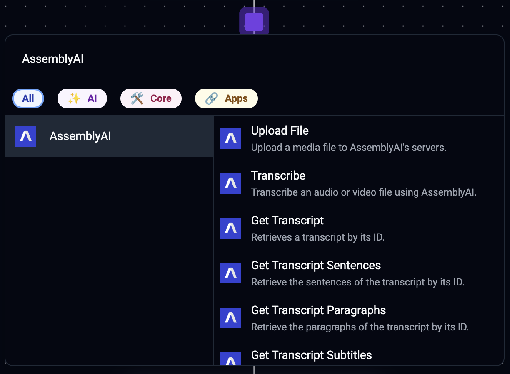
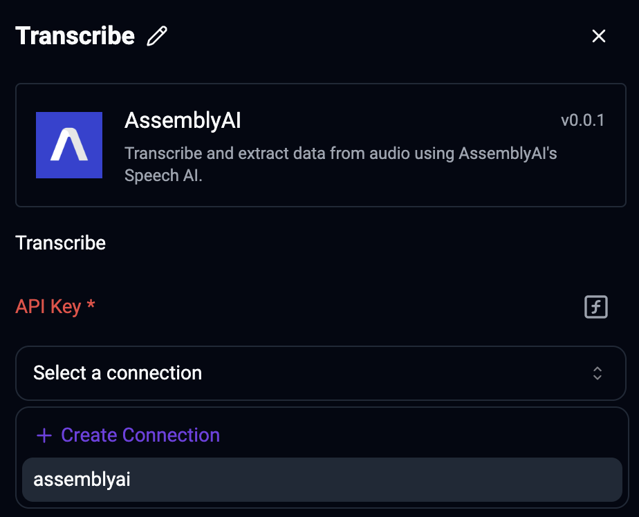
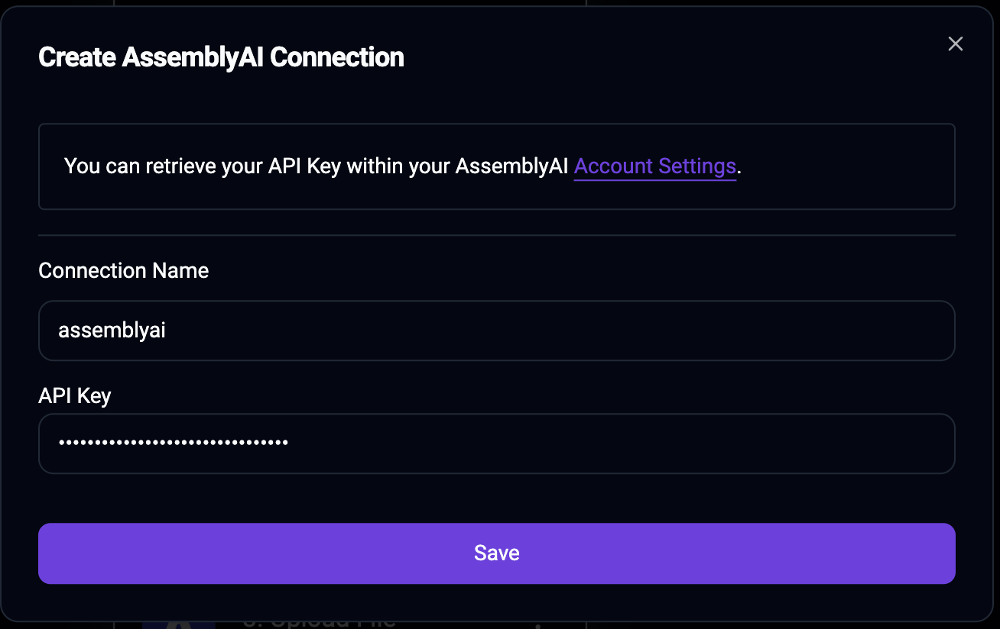

[Activepieces](https://www.activepieces.com/) is an open-source, no-code automation platform that enables users to streamline workflows by connecting various applications and automating tasks.

With the AssemblyAI piece for Activepieces, you can use AssemblyAI to transcribe audio data with speech recognition models, analyze the data with audio intelligence models, and build generative features on top of it with LLMs.
You can supply audio to the AssemblyAI piece and connect the output of any of AssemblyAI's models to other services in your Activepieces flow.

## Quickstart

<Steps>
<Step>
Create or edit a flow in Activepiece. Add a trigger of your choosing, and then click the plus-icon to add a new action.
Search for AssemblyAI, click on the AssemblyAI piece, and select the action that you want to use.

</Step>
<Step>

Create a new connection or select an existing one.

In the **API Key** field, enter the API key from your [AssemblyAI dashboard](https://www.assemblyai.com/dashboard/login), and click **Save**.

</Step>
<Step>

Finally, configure your AssemblyAI action. Continue reading to learn more about all the available action.

</Step>
</Steps>

## AssemblyAI actions

The AssemblyAI piece for Activepieces provides the following actions:

### Files

#### Upload File

Upload an audio file to AssemblyAI so you can transcribe it.
You can pass the `Upload URL` output field to the `Audio URL` input field of [Transcribe an Audio File](#transcribe-an-audio-file) module.

### Transcripts

#### Transcribe

Transcribe an audio file and wait until the transcript has completed or failed.
Configure the `Audio URL` field with the URL of the audio file you want to transcribe.
The `Audio URL` must be accessible by AssemblyAI's servers.
If you don't have a publicly accessible URL, you can use the [Upload a File](#upload-a-file) module to upload the audio file to AssemblyAI.

If you don't want to wait until the transcript is ready, uncheck the `Wait until transcript is ready` parameter.

<Info>
  Configure your desired [Audio Intelligence models](/audio-intelligence) when
  you create the transcript. The results of the models will be included in the
  transcript output.
</Info>

#### Get Transcript

Retrieve a transcript by ID.

#### Get Transcript Paragraphs

Retrieve the paragraphs of a transcript.

<Note>You can only invoke this module after the transcript is completed.</Note>

#### Get Transcript Sentences

Retrieve the sentences of a transcript.

<Note>You can only invoke this module after the transcript is completed.</Note>

#### Get Transcript Subtitles

Create SRT or VTT subtitles for a transcript.

<Note>You can only invoke this module after the transcript is completed.</Note>

#### Get Transcript Redacted Audio

First, you need to configure PII audio redaction using these fields when you create the transcript:

- `Redact PII`: `Checked`
- `Redact PII Audio`: `Checked`
- `Redact PII Policies`: Configure at least one PII policy

Then, you can use this module to retrieve the redacted audio of the transcript.

<Note>You can only invoke this module after the transcript is completed.</Note>

#### Search words in transcript

Search for words in a transcript.

<Note>You can only invoke this module after the transcript is completed.</Note>

#### List transcripts

Paginate over all transcripts.

#### Delete transcript

Delete a transcript by ID.
Deleting a transcript doesn't delete the transcript resource itself, but removes the data from the resource and marks it as deleted.

<Note>
  You can only invoke this module after the transcript status is "completed" or
  "error".
</Note>

### LeMUR

#### Run a Task using LeMUR

Prompt different LLMs over your audio data using LeMUR.
You have to configure either the `Transcript IDs` or `Input Text` input field.

#### Retrieve LeMUR response

Retrieve a LeMUR response that was previously generated.

#### Purge LeMUR request data

Delete the data for a previously submitted LeMUR request.
Response data from the LLM, as well as any context provided in the original request will be removed.

### Other actions

#### Custom API Call

Make your own REST API HTTP requests to the AssemblyAI API using your existing connection.

## Additional resources

You can learn more about using Activepieces with AssemblyAI in these resources:

- [AssemblyAI Integrations on Activepieces](https://www.activepieces.com/pieces/assemblyai)
- [npmjs page for @activepieces/piece-assemblyai](https://www.npmjs.com/package/@activepieces/piece-assemblyai)
