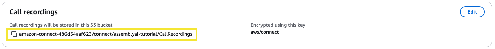
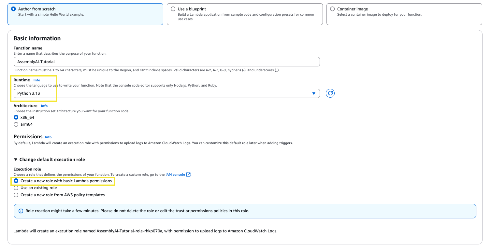
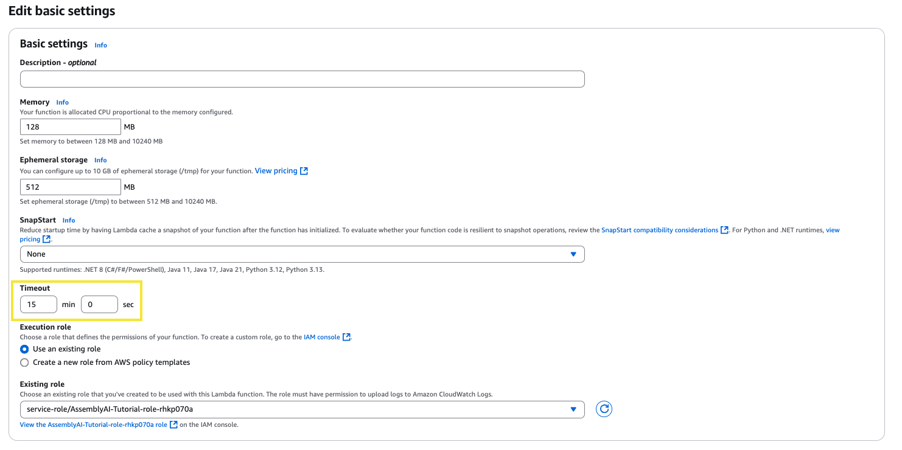
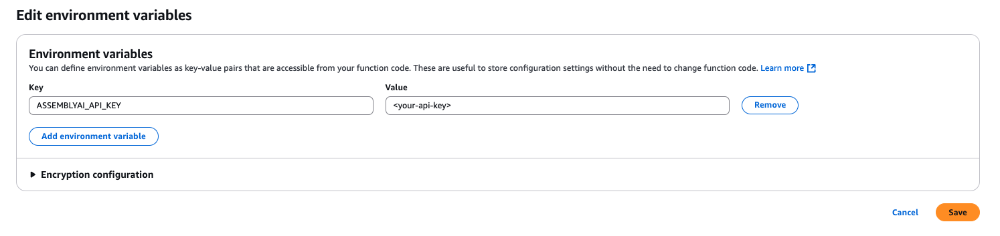
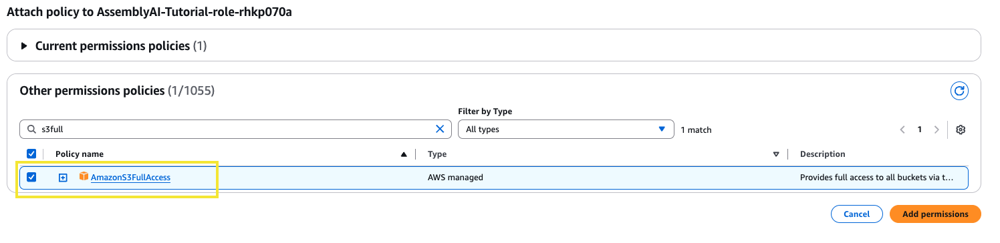
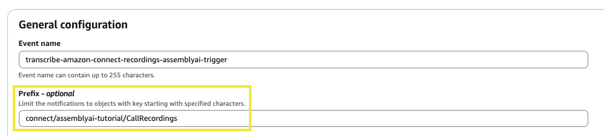
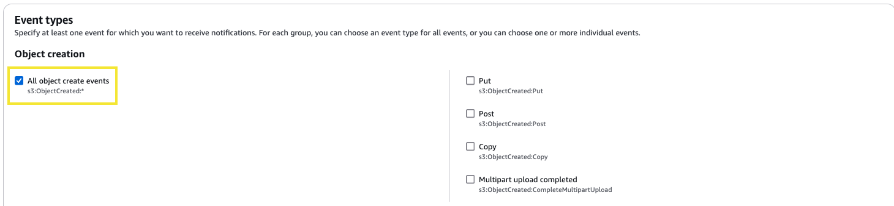
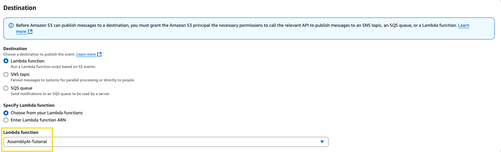
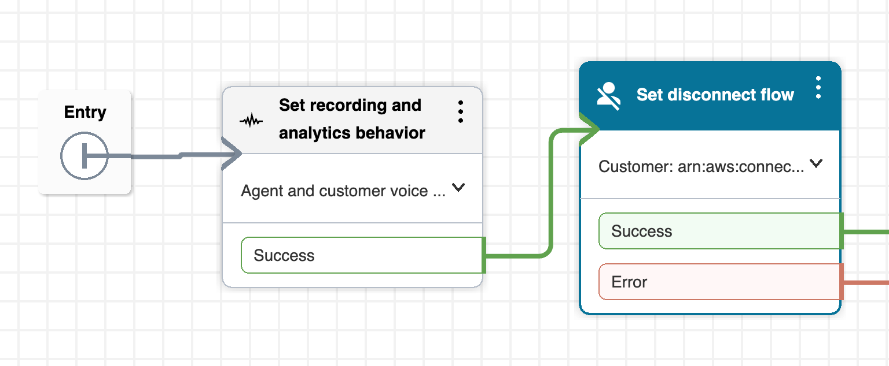
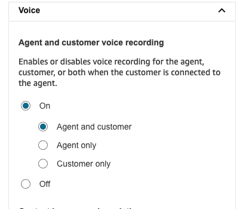

This guide walks through the process of setting up a transcription pipeline for Amazon Connect recordings using AssemblyAI.

### Get Started

Before we begin, make sure you have:

- An AssemblyAI account and an API key. You can [sign up](https://assemblyai.com/dashboard/signup) for a free account and get your API key from your dashboard.
- An AWS account.
- An [Amazon Connect instance](https://docs.aws.amazon.com/connect/latest/adminguide/amazon-connect-instances.html).

## Step-by-Step Instructions

<Steps>
  <Step>
    In the AWS console, navigate to the **Amazon Connect** services page. Select your instance and then click into the **Data Storage** section. On this page, find the subsection named **Call Recordings** and note the S3 bucket path where your call recordings are stored, you'll need this for later.
    
  </Step>
  <Step>
    Navigate to the **Lambda** services page, and create a new function. Set the runtime to **Python 3.13**. In the **Change default execution role** section, choose the option to create a new role with basic Lambda permissions. Assign a function name and then click **Create function**.
    
  </Step>
  
  <Step>
    In this new function, scroll down to the **Code Source** section and paste the following code into `lambda_function.py`.
```python
import json
import os
import boto3
import http.client
import time
from urllib.parse import unquote_plus
import logging

# Configure logging

logger = logging.getLogger()
logger.setLevel(logging.INFO)

# Configuration settings

# See config parameters here: https://www.assemblyai.com/docs/api-reference/transcripts/submit

ASSEMBLYAI_CONFIG = {

# 'language_code': 'en_us',

# 'multichannel': True,

# 'redact_pii': True,

}

# Initialize AWS services

s3_client = boto3.client('s3')

def get_presigned_url(bucket, key, expiration=3600):
"""Generate a presigned URL for the S3 object"""

logger.info({
"message": "Generating presigned URL",
"bucket": bucket,
"key": key,
"expiration": expiration
})

s3_client_with_config = boto3.client(
's3',
config=boto3.session.Config(signature_version='s3v4')
)

return s3_client_with_config.generate_presigned_url(
'get_object',
Params={'Bucket': bucket, 'Key': key},
ExpiresIn=expiration
)

def delete_transcript_from_assemblyai(transcript_id, api_key):
"""
Delete transcript data from AssemblyAI's database using their DELETE endpoint.

Args:
transcript_id (str): The AssemblyAI transcript ID to delete
api_key (str): The AssemblyAI API key

Returns:
bool: True if deletion was successful, False otherwise
"""
headers = {
"authorization": api_key,
"content-type": "application/json"
}

conn = http.client.HTTPSConnection("api.assemblyai.com")

try: # Send DELETE request to AssemblyAI API
conn.request("DELETE", f"/v2/transcript/{transcript_id}", headers=headers)
response = conn.getresponse()

       # Check if deletion was successful (HTTP 200)
       if response.status == 200:
           response_data = json.loads(response.read().decode())
           logger.info(f"Successfully deleted transcript {transcript_id} from AssemblyAI")
           return True
       else:
           error_message = response.read().decode()
           logger.error(f"Failed to delete transcript {transcript_id}: HTTP {response.status} - {error_message}")
           return False

except Exception as e:
logger.info(f"Error deleting transcript {transcript_id}: {str(e)}")
return False
finally:
conn.close()

def transcribe_audio(audio_url, api_key):
"""Transcribe audio using AssemblyAI API with http.client"""
logger.info({"message": "Starting audio transcription"})

headers = {
"authorization": api_key,
"content-type": "application/json"
}

conn = http.client.HTTPSConnection("api.assemblyai.com")

# Submit the audio file for transcription with config parameters

request_data = {"audio_url": audio_url}

# Add all configuration settings

request_data.update(ASSEMBLYAI_CONFIG)

json_data = json.dumps(request_data)
conn.request("POST", "/v2/transcript", json_data, headers)
response = conn.getresponse()

if response.status != 200:
raise Exception(f"Failed to submit audio for transcription: {response.read().decode()}")

response_data = json.loads(response.read().decode())
transcript_id = response_data['id']
logger.info({"message": "Audio submitted for transcription", "transcript_id": transcript_id})

# Poll for transcription completion

while True:
conn = http.client.HTTPSConnection("api.assemblyai.com")
conn.request("GET", f"/v2/transcript/{transcript_id}", headers=headers)
polling_response = conn.getresponse()
polling_data = json.loads(polling_response.read().decode())

       if polling_data['status'] == 'completed':
           conn.close()
           logger.info({"message": "Transcription completed successfully"})
           return polling_data  # Return full JSON response instead of just text
       elif polling_data['status'] == 'error':
           conn.close()
           raise Exception(f"Transcription failed: {polling_data['error']}")

       conn.close()
       time.sleep(3)

def lambda_handler(event, context):
"""Lambda function to handle S3 events and process audio files"""
try: # Get the AssemblyAI API key from environment variables
api_key = os.environ.get('ASSEMBLYAI_API_KEY')
if not api_key:
raise ValueError("ASSEMBLYAI_API_KEY environment variable is not set")

       # Process each record in the S3 event
       for record in event.get('Records', []):
           # Get the S3 bucket and key
           bucket = record['s3']['bucket']['name']
           key = unquote_plus(record['s3']['object']['key'])

           # Generate a presigned URL for the audio file
           audio_url = get_presigned_url(bucket, key)

           # Get the full transcript JSON from AssemblyAI
           transcript_data = transcribe_audio(audio_url, api_key)

           # Prepare the transcript key - maintaining path structure but changing directory and extension
           transcript_key = key.replace('/CallRecordings/', '/AssemblyAITranscripts/', 1).replace('.wav', '.json')

           # Convert the JSON data to a string
           transcript_json_str = json.dumps(transcript_data, indent=2)

           # Upload the transcript JSON to the same bucket but in transcripts directory
           s3_client.put_object(
               Bucket=bucket,  # Use the same bucket
               Key=transcript_key,
               Body=transcript_json_str,
               ContentType='application/json'
           )
           logger.info({"message": "Transcript uploaded to transcript bucket successfully.", "key": transcript_key})

           # Uncomment the following line to delete transcript data from AssemblyAI after saving to S3
           # https://www.assemblyai.com/docs/api-reference/transcripts/delete
           # delete_transcript_from_assemblyai(transcript_data['id'], api_key)

       return {
           "statusCode": 200,
           "body": json.dumps({
               "message": "Audio file(s) processed successfully",
               "detail": "Transcripts have been stored in the AssemblyAITranscripts directory"
           })
       }

except Exception as e:
print(f"Error: {str(e)}")
return {
"statusCode": 500,
"body": json.dumps({
"message": "Error processing audio file(s)",
"error": str(e)
})
}

````
  </Step>
  <Step>
    At the top of the lambda function, you can edit the config to enable features for your transcripts. To see all available parameters, check out our [API reference](https://www.assemblyai.com/docs/api-reference/transcripts/submit).
```python
ASSEMBLYAI_CONFIG = {
   # 'language_code': 'en_us',
   # 'multichannel': True,
   # 'redact_pii': True,
}
````

<Tip>
  If you would like to delete transcripts from AssemblyAI after completion, you
  can uncomment line **166** to enable the `delete_transcript_from_assemblyai`
  function. This ensures the transcript data is only saved on your S3 database
  and not stored on AssemblyAI's database.
</Tip>

Once you have finished editing the lambda function, click **Deploy** to save your changes.

  </Step>
  <Step> 
On the same page, navigate to the **Configuration** section, under **General configuration** adjust the timeout to 15min 0sec and click **Save**. The processing times for transcription will be a lot shorter, but this ensures plenty of time for the function to complete.

  </Step>
  <Step>
Now from this page, on the left side panel click **Environment variables**. Click edit and then add an environment variable, `ASSEMBLYAI_API_KEY`, and set the value to your AssemblyAI API key. Then click **Save**.

  </Step>
  <Step>
Now, navigate to the **IAM** services page. On the left side panel under Access Management click **Roles** and search for your Lambda function role (it's structure should look like `function_name-role-id`). Click into the role and then in the **Permissions policies** section click the dropdown for **Add permissions** and then select **Attach policies**.
From this page, find the policy named `AmazonS3FullAccess` and click **Add permissions**.

  </Step>
  <Step>
Now, navigate to the **S3** services page and click into the general purpose bucket where your Amazon Connect recordings are stored. Browse to the **Properties** tab and then scroll down to **Event notifications**. Click **Create event notification**. Give the event a name and then in the prefix section, insert the folder path we noted from Step 1 to ensure the event is triggered for the correct folder.

Then in the **Event types** section, select **All object create events**.

Then scroll down to the **Destination** section, set the destination as **Lambda function** and then select the Lambda function we created in Step 2. Then click **Save changes**.

  </Step>
  <Step>
To finalise the integration, we'll need to set the recording behaviour from within your AWS Contact Flows. Navigate to your Amazon Connect instance access URL and sign in to your Admin account. In the left side panel, navigate to the **Routing** section and then select **Flows**.
Choose a flow to test with, in this case we'll utilize the `Sample inbound flow (first contact experience)`. You should see the **Block Library** on the left hand side of the page. In this section, search for `Set recording and analytics behaviour` and then drag the block into your flow diagram and connect the arrows.
You can see in our example, we place the block right at the entry of the call flow:


After connecting this block, click the 3 vertical dots in the top right of the block and select **Edit settings**. Scroll down to the **Enable recording and analytics** subsection and expand the **Voice** section. Then select `On` and select `Agent and customer` (or whoever you'd like to record). Then click **Save**, click **Save** again in the top right and then click **Publish** to publish the flow.



With this new flow published, you should now receive recordings for your Amazon Connect calls that utilize that flow, and you should now receive AssemblyAI transcripts for those recordings!

<Info>
The Amazon Connect Call Recordings are saved in the S3 bucket with this naming convention:
**/connect/\{instance-name\}/CallRecordings/\{YYYY\}/\{MM\}/\{DD\}/\{contact-id\}_\{YYYYMMDDThh:mm\}_UTC.wav**

The AssemblyAI Transcripts will be saved in the S3 bucket with this naming convention:
**/connect/\{instance-name\}/AssemblyAITranscripts/\{YYYY\}/\{MM\}/\{DD\}/\{contact-id\}\_\{YYYYMMDDThh:mm\}\_UTC.json**

</Info>
  </Step>
  <Step>
To view the logs for this integration, navigate to the **CloudWatch** services page and under the **Logs** section, select **Log groups**. Select the log group that matches your Lambda to view the most recent log stream.
  </Step>
</Steps>
