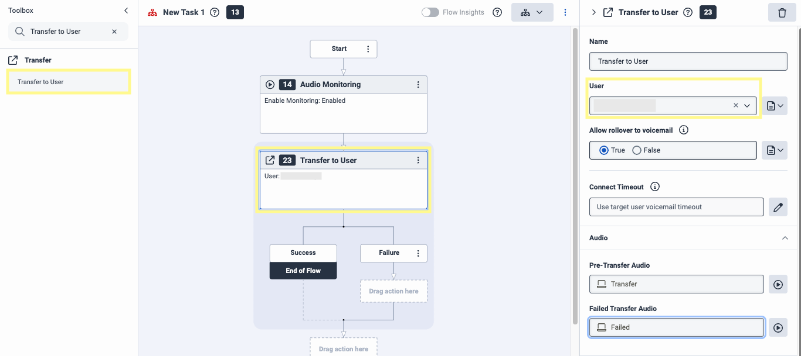
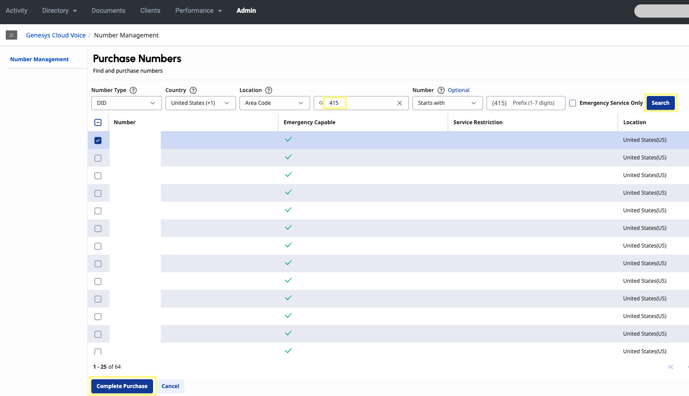

This guide walks through the process of setting up a transcription pipeline to send audio data from Genesys Cloud to AssemblyAI.

To accomplish this, we'll stream audio through Genesys's [AudioHook Monitor](https://appfoundry.genesys.com/filter/genesyscloud/listing/a3ff6a99-d866-4734-ab7a-16cff2e4308c) integration to a WebSocket server.
Upon call completion, the server will process this audio into a wav file and send it to AssemblyAI's Speech-to-text API for [pre-recorded audio](/docs/speech-to-text/pre-recorded-audio) transcription.

You can find all the necessary code for this guide [here](https://github.com/gsharp-aai/genesys-async-guide).

## Architecture Overview
Here's the general flow our app will follow:
```
+---------------------+     +--------------------+     +----------------------+
| 1. Genesys Cloud    |  →  | 2. WebSocket       |  →  | 3. Convert Raw       |
| (AudioHook Monitor) |     | Server             |     | Audio to WAV         |
+---------------------+     +--------------------+     +----------------------+
                                                                 ↓                                                             
+--------------------+     +---------------------+     +----------------------+
| 6. S3 Bucket       |  ←  | 5. AssemblyAI API   |  ←  | 4. Audio Upload (S3) |
| (Transcript Store) |     | (Transcription)     |     | (Trigger Lambda)     |
+--------------------+     +---------------------+     +----------------------+
```

## Getting started
Before we begin, make sure you have:
- An AssemblyAI account and an API key. You can [sign up](https://assemblyai.com/dashboard/signup) for a free account and get your API key from your [dashboard](https://www.assemblyai.com/dashboard/api-keys).
- An AWS account, an [Access key](https://us-east-1.console.aws.amazon.com/iam/home#/security_credentials), and permissions to S3, Lambda, and CloudWatch.
- A [Genesys Cloud](https://www.genesys.com/genesys-cloud) account with the necessary permissions to create call flows, phone numbers, and routes.
- [ngrok](https://ngrok.com/downloads/mac-os) installed.

## Genesys AudioHook Monitor

In order to stream your voice calls to third party services outside of the Genesys Cloud platform, Genesys offers an official integration called [AudioHook Monitor](https://appfoundry.genesys.com/filter/genesyscloud/listing/a3ff6a99-d866-4734-ab7a-16cff2e4308c).

This integration allows you to specify the URL of a [WebSocket server](https://developer.mozilla.org/en-US/docs/Web/API/WebSockets_API) that implements the [AudioHook Protocol](https://developer.genesys.cloud/devapps/audiohook/), and once a connection has been established, Genesys will send both text (metadata messages/events encoded as JSON) and binary data (WebSocket frames containing the raw audio data in μ-law (Mu-law, PCMU) format).

An understanding of this integration and protocol is recommended before proceeding with this tutorial. Here are some helpful resources to get started:

- [Genesys App Foundry](https://appfoundry.genesys.com/filter/genesyscloud/listing/a3ff6a99-d866-4734-ab7a-16cff2e4308c)
- [AudioHook Monitor](https://help.mypurecloud.com/articles/about-audiohook-monitor/)
- [AudioHook Protocol](https://developer.genesys.cloud/devapps/audiohook/)
- [AudioHook Sample Service Repo](https://github.com/purecloudlabs/audiohook-reference-implementation#genesys-audiohook-sample-service)

## Step 1: Create a call flow in Genesys (optional)
You may already have an inbound call flow set up in Genesys (if so, skip to [Step 3](/docs/integrations/genesys-cloud#step-3-create-a-s3-bucket)), but we'll create a simple one from scratch for the sake of this tutorial.

<Note title="Adapting existing call flows">
All you need to add is the **Audio Monitoring** step from the toolbox and make sure **Suppress recording for the entire flow** is unchecked in the flow's **Recording and Speech Recognition** settings.
</Note>

<Steps>
<Step>

Within the [Architect tool](https://apps.usw2.pure.cloud/architect/#/inboundcall/flows), click **Add** to create a new call flow. Enter a **Name** for your flow and click **Create Flow**. Select the newly created flow to open the drag and drop editor.


</Step>
<Step>

Create a **Reusable Task** from the bottom left of the left-side menu. From the Toolbox, search for **Audio Monitoring** and drag it just after the **Start** step of our flow. In the right-side menu for this option, make sure **Enable Monitoring** is enabled.


</Step>
<Step>

Back in the Toolbox, search for **Transfer to User** and set that as the next step. In the right-hand menu, under **User** select a caller. Under **Pre-Transfer Audio** and **Failed Transfer Audio**, type your preferred messages.


</Step>
<Step>

Search for **Disconnect** in the toolbox and drag that as the step following **Failure**.


</Step>
<Step>

Search the Toolbox for **Jump to Reusable Task** and drag this tool to the Main Menu at the top of the left-side menu. Select a **DTMF** and **Speech Recognition** value (this will be used to transfer your call to the agent). Under **Task**, select the task you just created.


</Step>
<Step>

Under Settings in the left-side menu, navigate to the **Recording and Speech Recognition** section. Make sure **Suppress recording for the entire flow** is unchecked.


</Step>
<Step>

In the top navbar, make sure to click **Save** and then click **Publish** to have your changes take effect.

</Step>
</Steps>

## Step 2: Setup a phone and routing for your flow (optional)
<Steps>
<Step>

In the Genesys Cloud Admin section, navigate to the [Phones page](https://apps.usw2.pure.cloud/directory/#/admin/telephony/phone-management/phones) under the **Telephony section** and click **Add** to create a new phone. For **Person**, assign the User from your organization that you selected for the **Transfer to User** step in the [previous section](/docs/integrations/genesys-cloud#step-3).


</Step>
<Step>

Navigate to the [Number Management](https://apps.usw2.pure.cloud/directory/#/admin/telecom/numbers/numbers) page under the **Genesys Cloud Voice** section and select **Purchase Numbers**.
Enter an area code and click **Search**. Select a phone number from the list and click **Complete Purchase**.




</Step>
<Step>

Navigate to the [Call Routing](https://apps.usw2.pure.cloud/directory/#/admin/routing/ivrs) page under the **Routing** section and select **Add**. Under **What call flow should be used?** select your flow. For **Inbound Numbers**, type the number you purchased in the above step. Then click **Create**.


</Step>
<Step>

Under the **Telephony** section, navigate to the [External Trunks](https://apps.usw2.pure.cloud/directory/#/admin/telephony/trunks/external) page. Click **Create New**. Under **Caller ID**, the **Caller Address** will be an E.164 number and the phone number you created. 


</Step>
<Step>

Under **SIP Access Control**, select **Allow All** (*note: this is only for development and testing purposes, please specify actual IPs in production*). Under the **Media** section, make sure you select **Record calls on this trunk**. Then click **Save External Trunk** (it may take a few moments for your trunk to be ready).


</Step>
</Steps>

## Step 3: Create a S3 bucket

After our Genesys call ends, store the audio file in S3.
<Steps>
<Step>

Click **Create bucket**. Give your bucket a name like `your-audiohook-bucket`. Scroll down and click **Create bucket**.


</Step>
</Steps>

## Step 4: Create a WebSocket server
In this step, we'll set up a WebSocket server to receive messages and audio data from Genesys as they are sent.
Our server must respond to certain events (i.e. `open`, `close`, `ping`, `pause`, etc.) according to the AudioHook protocol.
Outside of these event messages, audio data is also transferred. We'll capture and temporarily store this audio locally until the connection is closed, at which point the server processes the audio to a `wav` file and uploads both the `wav` and `raw` audio files to a S3 bucket.

The AudioHook Monitor will send requests to a WebSocket URL we specify when setting up the integration in [Step 5](/docs/integrations/genesys-cloud#step-5-setting-up-audiohook-monitor).
When first enabled, AudioHook Monitor will do a quick verification step to ensure that the WebSocket server has implemented the AudioHook protocol correctly.

For this example, the server is written in JavaScript ([Express](https://expressjs.com/)) and hosted locally. We'll use [ngrok](https://ngrok.com/) to create a secure tunnel that exposes it to the internet with a public URL so that Genesys can make a connection.
However, the server can be implemented using your preferred programming language and deployed in whatever environment you choose, provided both support WebSocket TLS connections for secure bidirectional text and binary message exchange.

<Note title="Server implementation">
This server is a method to get up and running quickly for development and testing purposes without the complexity of a production deployment. How you implement this in practice will vary widely depending on your traffic volume, scaling needs, reliability requirements, security concerns, etc.
</Note>

<Steps>
<Step>

Clone this [example repo](https://github.com/gsharp-aai/genesys-async-guide) of a WebSocket server that implements the AudioHook protocol.
Follow the `README` instructions to download the necessary dependencies and start the server.
Make sure to look over `server.js` to get an understanding of how the requests from Genesys are received, processed, and responded to, as well as how the audio is stored, converted, and uploaded to our S3 bucket.

</Step>
<Step>

Make sure to create a `.env` file and set the variables:

```bash
PORT=3000
AWS_REGION=us-east-1 # Region of your S3 bucket
AWS_ACCESS_KEY_ID=<ACCESS_ID> # Found under IAM > Security Credentials
AWS_SECRET_ACCESS_KEY=<SECRET_KEY> # Found under IAM > Security Credentials
S3_BUCKET=your-audiohook-bucket # Name of your S3 bucket
S3_KEY_PREFIX=calls/ # The file structure you want your bucket to follow
API_KEY=<YOUR_API_KEY> # Used for authenticating messages from Genesys
RECORDINGS_DIR=./recordings # Temp file storage location
```

<Note>
`AWS_ACCESS_KEY_ID` and `AWS_SECRET_ACCESS_KEY` can be found on your account's [IAM > Security Credentials page](https://us-east-1.console.aws.amazon.com/iam/home?region=us-east-1#/security_credentials). `API_KEY` is explained further in the [next step](/docs/integrations/genesys-cloud#step-3-3), but it can be anything you want to verify that the requests are actually originating from Genesys.
</Note>

</Step>
<Step>

Download [ngrok](https://ngrok.com/). Assuming your server is running on `port 3000`, run `ngrok http 3000 --inspect=false` in your terminal.
From the resulting terminal output, note the forwarding url that should look something like this: `https://<id>.ngrok-free.app`. This is our WebSocket server URL that we'll provide to the AudioHook Monitor in the next step.


</Step>
</Steps>

## Step 5: Setting up AudioHook Monitor

<Steps>
<Step>

In the Genesys Cloud Admin section, navigate to the [Integrations](https://apps.usw2.pure.cloud/directory/#/admin/integrations/apps) page. Add a new integration via the plus sign in the top right corner.


</Step>

<Step>

Search for **AudioHook Monitor** and install.


</Step>
<Step>

Navigate to the AudioHook Monitor's **Configuration** tab. Under the **Properties section**, make sure both channels are selected and the **Connection URI** is set to the ngrok url from the [previous step](/docs/integrations/genesys-cloud#step-3-2). For the ngrok url, replace `https` with `wss`.


</Step>
<Step>

In the **Configuration** tab, navigate to the **Credentials** section, and click **Configure**. Here you can set an API key to a value our server will use to verify that requests originated from Genesys. This is done via the `X-API-KEY` request header. Our server will compare this key to the value we set in our `.env` for `API_KEY`, so make sure they match. Click **Save**.


</Step>
<Step>

Back on the **Integrations** page, click the toggle button under the **Status** column to activate your AudioHook. Genesys will attempt to verify our server is correctly configured according to the AudioHook protocol. If it is unable to do so, a red error will show with the reason for the failed connection. If it succeeds, the connection will toggle to Active.


</Step>
</Steps>

## Step 6: Set up your AssemblyAI API call

<Steps>
<Step>

Navigate to the [Lambda](https://us-east-1.console.aws.amazon.com/lambda/home) services page, and create a new function. Set the runtime to `Node.js 22.x`. In the **Change default execution role** section, choose the option to create a **new role with basic Lambda permissions**. Assign a function name and then click **Create function**.


</Step>
<Step>

In this new function, scroll down to the **Code Source** section and paste the following code into `index.js`:

```javascript
// Import required AWS SDK modules
import { S3 } from '@aws-sdk/client-s3';
import { getSignedUrl } from '@aws-sdk/s3-request-presigner';
import { GetObjectCommand } from '@aws-sdk/client-s3';

// Configure logging
const logger = {
  info: (data) => console.log(JSON.stringify(data)),
  error: (data) => console.error(JSON.stringify(data))
};

// Configuration settings for AssemblyAI
// See config parameters here: https://www.assemblyai.com/docs/api-reference/transcripts/submit
const ASSEMBLYAI_CONFIG = {
  multichannel: true // Using multichannel here as we told Genesys to send us multichannel audio.
};

// Initialize AWS S3 client
const s3Client = new S3();

/**
 * Generate a presigned URL for the S3 object
 * @param {string} bucket - S3 bucket name
 * @param {string} key - S3 object key
 * @param {number} expiration - URL expiration time in seconds
 * @returns {Promise<string>} Presigned URL
 */
const getPresignedUrl = async (bucket, key, expiration = 3600) => {
  logger.info({
    message: "Generating presigned URL",
    bucket: bucket,
    key: key,
    expiration: expiration
  });

  const command = new GetObjectCommand({
    Bucket: bucket,
    Key: key
  });

  return getSignedUrl(s3Client, command, { expiresIn: expiration });
}

/**
 * Delete transcript data from AssemblyAI's database
 * @param {string} transcriptId - The AssemblyAI transcript ID to delete
 * @param {string} apiKey - The AssemblyAI API key
 * @returns {Promise<boolean>} True if deletion was successful, False otherwise
 */
const deleteTranscriptFromAssemblyAI = async (transcriptId, apiKey) => {
  try {
    const response = await fetch(`https://api.assemblyai.com/v2/transcript/${transcriptId}`, {
      method: 'DELETE',
      headers: {
        'authorization': apiKey,
        'content-type': 'application/json'
      }
    });
    
    if (response.ok) {
      logger.info(`Successfully deleted transcript ${transcriptId} from AssemblyAI`);
      return true;
    } else {
      const errorData = await response.text();
      logger.error(`Failed to delete transcript ${transcriptId}: HTTP ${response.status} - ${errorData}`);
      return false;
    }
  } catch (error) {
    logger.error(`Error deleting transcript ${transcriptId}: ${error.message}`);
    return false;
  }
}

/**
 * Submit audio for transcription
 * @param {object} requestData - Request data including audio URL and config
 * @param {string} apiKey - AssemblyAI API key
 * @returns {Promise<string>} Transcript ID
 */
const submitTranscriptionRequest = async (requestData, apiKey) => {
  const response = await fetch('https://api.assemblyai.com/v2/transcript', {
    method: 'POST',
    headers: {
      'authorization': apiKey,
      'content-type': 'application/json'
    },
    body: JSON.stringify(requestData)
  });

  if (!response.ok) {
    const errorText = await response.text();
    throw new Error(`Failed to submit audio for transcription: ${errorText}`);
  }

  const responseData = await response.json();
  const transcriptId = responseData.id;
  
  logger.info({
    message: "Audio submitted for transcription",
    transcript_id: transcriptId
  });
  
  return transcriptId;
}

/**
 * Poll for transcription completion
 * @param {string} transcriptId - Transcript ID
 * @param {string} apiKey - AssemblyAI API key
 * @returns {Promise<object>} Transcription data
 */
const pollTranscriptionStatus = async (transcriptId, apiKey) => {
  const sleep = (ms) => new Promise(resolve => setTimeout(resolve, ms));
  
  // Keep polling until we get a completion or error
  while (true) {
    const response = await fetch(`https://api.assemblyai.com/v2/transcript/${transcriptId}`, {
      method: 'GET',
      headers: {
        'authorization': apiKey,
        'content-type': 'application/json'
      }
    });

    if (!response.ok) {
      const errorText = await response.text();
      throw new Error(`Failed to poll transcription status: ${errorText}`);
    }

    const pollingData = await response.json();

    if (pollingData.status === 'completed') {
      logger.info({ message: "Transcription completed successfully" });
      return pollingData;
    } else if (pollingData.status === 'error') {
      throw new Error(`Transcription failed: ${pollingData.error}`);
    }
    
    // Wait before polling again
    await sleep(3000);
  }
}

/**
 * Transcribe audio using AssemblyAI API
 * @param {string} audioUrl - URL of the audio file
 * @param {string} apiKey - AssemblyAI API key
 * @returns {Promise<object>} Transcription data
 */
const transcribeAudio = async (audioUrl, apiKey) => {
  logger.info({ message: "Starting audio transcription" });

  // Prepare request data with config parameters
  const requestData = { audio_url: audioUrl, ...ASSEMBLYAI_CONFIG };
  
  // Submit the audio file for transcription
  const transcriptId = await submitTranscriptionRequest(requestData, apiKey);
  
  // Poll for transcription completion
  return await pollTranscriptionStatus(transcriptId, apiKey);
}

/**
 * Lambda function handler
 * @param {object} event - S3 event
 * @param {object} context - Lambda context
 * @returns {Promise<object>} Response
 */
export const handler = async (event, context) => {
  try {
    // Get the AssemblyAI API key from environment variables
    const apiKey = process.env.ASSEMBLYAI_API_KEY;
    if (!apiKey) {
      throw new Error("ASSEMBLYAI_API_KEY environment variable is not set");
    }

    // Process each record in the S3 event
    const records = event.Records || [];
    
    for (const record of records) {
      // Get the S3 bucket and key
      const bucket = record.s3.bucket.name;
      const key = decodeURIComponent(record.s3.object.key.replace(/\+/g, ' '));
      
      // Generate a presigned URL for the audio file
      const audioUrl = await getPresignedUrl(bucket, key);
      
      // Get the full transcript JSON from AssemblyAI
      const transcriptData = await transcribeAudio(audioUrl, apiKey);
      
      // Prepare the transcript key - maintaining path structure but changing directory and extension
      const transcriptKey = key
        .replace('audio', 'transcripts', 1)
        .replace('.wav', '.json');
      
      // Convert the JSON data to a string
      const transcriptJsonStr = JSON.stringify(transcriptData, null, 2);
      
      // Upload the transcript JSON to the same bucket but in transcripts directory
      await s3Client.putObject({
        Bucket: bucket,  // Use the same bucket
        Key: transcriptKey, // Store under the /transcripts directory
        Body: transcriptJsonStr,
        ContentType: 'application/json'
      });
      
      logger.info({
        message: "Transcript uploaded to transcript bucket successfully.",
        key: transcriptKey
      });
      
      // Uncomment the following line to delete transcript data from AssemblyAI after saving to S3
      // https://www.assemblyai.com/docs/api-reference/transcripts/delete
      // await deleteTranscriptFromAssemblyAI(transcriptData.id, apiKey);
    }

    return {
      statusCode: 200,
      body: JSON.stringify({
        message: "Audio file(s) processed successfully",
        detail: "Transcripts have been stored in the AssemblyAITranscripts directory"
      })
    };
  } catch (error) {
    console.error(`Error: ${error.message}`);
    return {
      statusCode: 500,
      body: JSON.stringify({
        message: "Error processing audio file(s)",
        error: error.message
      })
    };
  }
};
```

</Step>
<Step>

At the top of the Lambda function, you can edit the config to enable features for your transcripts. Since our call is two channels, we'll want to set `multichannel` to `true`. To see all available parameters, check out our [API reference](/docs/api-reference/transcripts/submit).
```javascript
ASSEMBLYAI_CONFIG = {
  'multichannel': true,
  // 'language_code': 'en_us',
  // 'redact_pii': true
  // etc.
}
```

<Tip>
If you would like to delete transcripts from AssemblyAI after completion, you can uncomment `line 212` to enable the `deleteTranscriptFromAssemblyAI` function. This ensures the transcript data is only saved to your S3 bucket and not stored on AssemblyAI's database.
</Tip>

</Step>
<Step>

Once you have finished editing the Lambda function, click **Deploy** to save your changes.


</Step>
<Step>

On the same page, navigate to the **Configuration** section. Under **General configuration**, click **Edit**, and then adjust **Timeout** to `15min 0sec` and click **Save**. The processing times for transcription will be much shorter, but this ensures the function will have plenty of time to run.


</Step>
<Step>

On the left side panel, click **Environment variables**. Click **Edit**. Add an environment variable, `ASSEMBLYAI_API_KEY`, and set the value to your AssemblyAI [API key](https://www.assemblyai.com/dashboard/api-keys). Then click **Save**.


</Step>
<Step>

Now, navigate to the [IAM](https://us-east-1.console.aws.amazon.com/iam/) services page. On the left side panel under **Access Management**, click **Roles** and search for your Lambda function's role (its structure should look like `<function_name>-<role_id>`). Click the role and then in the **Permissions policies** section click the dropdown for **Add permissions** and then select **Attach policies.**


</Step>
<Step>

From this page, find the policies named `AmazonS3FullAccess` and `CloudWatchEventsFullAccess`. Click **Add permissions** for both.


<Note>
`CloudWatchEventsFullAccess` is optional, but helpful for debugging purposes. Once your Lambda runs, it should output all logs to [CloudWatch](https://us-east-1.console.aws.amazon.com/cloudwatch) under a Log group `/aws/lambda/<your-lambda-fn>`
</Note>

</Step>
<Step>

Now, navigate to the [S3](https://us-east-1.console.aws.amazon.com/s3) services page and click into the general purpose bucket where your Genesys recordings are stored. Browse to the **Properties** tab and then scroll down to **Event notifications**. Click **Create event notification**.


</Step>
<Step>

Give the event a name and then in the **Prefix** section enter `calls/` (or whatever `S3_KEY_PREFIX` is set to), and in the **Suffix** section enter `.wav`. This will ensure the event is triggered once our `wav` file has been uploaded. In the **Event types** section, select **All object create events**.


</Step>
<Step>

Scroll down to the **Destination** section, set the destination as **Lambda function** and then select the Lambda function we created in [Step 6](/docs/integrations/genesys-cloud#step-2-4). Then click **Save changes**.


</Step>
</Steps>

## Step 7: Transcribe your first call

<Steps>
<Step>


To test everything is working, call the phone number you linked to this flow in [Step 2](/docs/integrations/genesys-cloud#step-2-setup-a-phone-and-routing-for-your-flow-optional). Referring to the example flow above, press the DTMF value on the key pad or say the Speech Recognition value. Once transferred, your WebSocket server should start to receive data and output to console:

```bash
{
  version: '2',
  id: '<id>',
  type: 'ping',
  seq: 4,
  position: 'PT8.2S',
  parameters: { rtt: 'PT0.035392266S' },
  serverseq: 3
}
Received binary audio data: 3200 bytes 
Received binary audio data: 3200 bytes
...
Processed 146KB of audio data so far
```

</Step>
<Step>

Once the call has ended, you should see the following server logs:

```bash
{
  version: '2',
  id: '<id>',
  type: 'close',
  seq: 5,
  position: 'PT10.2S',
  parameters: { reason: 'end' },
  serverseq: 4
}
Handling close message
Closing file stream
Converting raw audio to WAV: '<wav file name>'

# Skipping ffmpeg output for brevity...

Uploading recording '<raw file>' to S3
Successfully uploaded raw recording to S3: '<raw file>'
Successfully uploaded WAV recording to S3: '<wav file>'
Sent closed response, seq=5
WebSocket closed for session '<session_id>': code=1000, reason=Session Ended
Cleaning up session '<session_id>'
Deleted local raw recording file: '<raw_file>'
Deleted local WAV recording file: '<wav_file>'
```

</Step>
<Step>
  To view the logs for this Lambda function, navigate to the [CloudWatch](https://us-east-1.console.aws.amazon.com/cloudwatch) services page and under the Logs section, select **Log groups**.
  Select the log group that matches your Lambda to view the most recent log stream. This can be very useful for debugging purposes if you run into any issues.

  
</Step>
<Step>

Head to your S3 bucket. Within the `/calls` directory, files will be stored under a unique identifier with the following structure:

`your-audiohook-bucket/calls/<timestamp>_<call_id>_<speaker_id>/<file_type>`

with audio files (both `raw` and `wav`) under `/audio` and transcript responses under `/transcripts`.


<Note>
The `raw` file can be nice to have for conversions to other formats in the future, but this step can be omitted to save on storage costs.
</Note>

</Step>

<Step>
**Success!** You have successfully integrated AssemblyAI with Genesys Cloud via AudioHook Monitor. If you run into any issues or have further questions, please reach out to our [Support team](https://www.assemblyai.com/contact/support).
</Step>
</Steps>

## Other considerations

### Supported audio formats
- Audio is sent as binary WebSocket frames containing the raw audio data in the negotiated format. Currently, only μ-law (Mu-law, PCMU) is [supported](https://developer.genesys.cloud/devapps/audiohook/session-walkthrough#audio-streaming).
- Before being uploaded to S3, the audio is converted to `wav` format using [ffmpeg](https://ffmpeg.org/). As a lossless format, `wav` generally results in high transcription accuracy, but is not required. A full list of file formats supported by AssemblyAI's API can be found [here](/docs/faq/what-audio-and-video-file-types-are-supported-by-your-api).

### Multichannel
- As mentioned in [Step 6](/docs/integrations/genesys-cloud#step-2-4), the `multichannel` parameter should be enabled as the files are stereo utilizing one channel for each participant. When possible, multiple channels are recommended by AssemblyAI for the most accurate transcription results.
- If single channel is preferred, you can simplify the approach to only send a single channel with both speakers (via AudioHook) and adjust your server code to be single channel.
