Unlock the full potential of AssemblyAI and [n8n's](https://n8n.io/) automation platform by connecting AssemblyAI's speech-to-text and audio intelligence capabilities with over 1,000 apps, data sources, services, and n8n's built-in AI features.

The [AssemblyAI n8n integration](https://n8n.io/integrations/assemblyai/) is built and maintained by AssemblyAI, and verified by n8n.

n8n offers both cloud (covered by this tutorial) and self-hosted options, giving you flexibility in how you deploy your automations.

## Overview

This comprehensive tutorial walks you through building a complete AssemblyAI workflow within n8n Cloud that:
1. Watches for changes to a Google Drive folder
2. Once an audio file is added, submits a transcription request to AssemblyAI with the audio
3. Polls for the transcription process to complete
4. Once complete, processes the transcript into a text file with just the transcript text and speaker labels
5. Saves the processed transcript `.txt` file output to a Google Drive folder
6. Deletes the transcript from AssemblyAI's servers

<Note>
  The [Google Drive n8n integration](https://n8n.io/integrations/google-drive/) is used in this example for file storage and triggering, but you can adapt the workflow to use other services like Dropbox, Amazon S3, FTP/SFTP, or webhooks based on your needs.
  
  For all available integrations, see the [n8n integrations page](https://n8n.io/integrations/).
</Note>

## Prerequisites

Before you begin, you'll need:

- An [AssemblyAI API key](https://www.assemblyai.com/dashboard/api-keys)
  - Sining up for an AssemblyAI account is free! An account on the free tier can transcribe up to **\$50 in transcription** and will be able to process up to **five files concurrently**. If you upgrade your account before using \$50 in transcription any unused amount will be retained on your account.
- An n8n account, either via [n8n Cloud](https://app.n8n.cloud/register) (reccomended) or a self-hosted instance.
- A [Google Cloud account](https://console.cloud.google.com/) for Google Drive API access
  - A folder in Google Drive to monitor for new audio files (`/audio_files`)
  - A folder in Google Drive to save the formatted `.txt` transcript output (`/transcripts`)

## Credentials

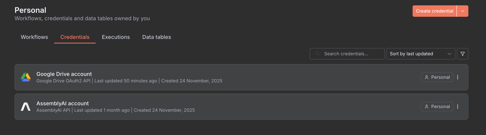

Before building your workflow, you'll need to configure credentials for both Google Drive and AssemblyAI in n8n.

### Google Drive OAuth Credentials

1. Go to your n8n credentials page
2. Click **Add Credential** and search for **"Google Drive OAuth2 API"**
3. Follow the setup process to connect your Google Drive account with Google Cloud Console:
   - [Video tutorial: Setting up Google Drive credentials](https://www.youtube.com/watch?v=FBGtpWMTppw&t=244s)
   - [n8n documentation: Google OAuth setup](https://docs.n8n.io/integrations/builtin/credentials/google/oauth-single-service/)
4. Save the credential

### AssemblyAI Credentials

1. Go to your n8n credentials page
2. Click **Add Credential** and search for **"AssemblyAI API"**
3. Enter your [AssemblyAI API key](https://www.assemblyai.com/dashboard/api-keys)
4. Save the credential

Once both credentials are configured, you can use them throughout your workflow.

## Instructions

### Step 1: Set Up Your Workflow and Trigger

<Steps>

<Step title="Create a new workflow on n8n">

1. Log in to your n8n account (either [n8n Cloud](https://app.n8n.cloud/login) or your self-hosted instance)
2. Click the **+** icon or **New Workflow** to create a new workflow
3. Give your workflow a descriptive name (e.g., "AssemblyAI Transcription Pipeline")
4. Install the AssemblyAI node:
   - Click the **+** icon to open the nodes panel
   - Search for "AssemblyAI"
   - Click the **Install** button next to the AssemblyAI node

</Step>

<Step title="Choose Your Trigger">

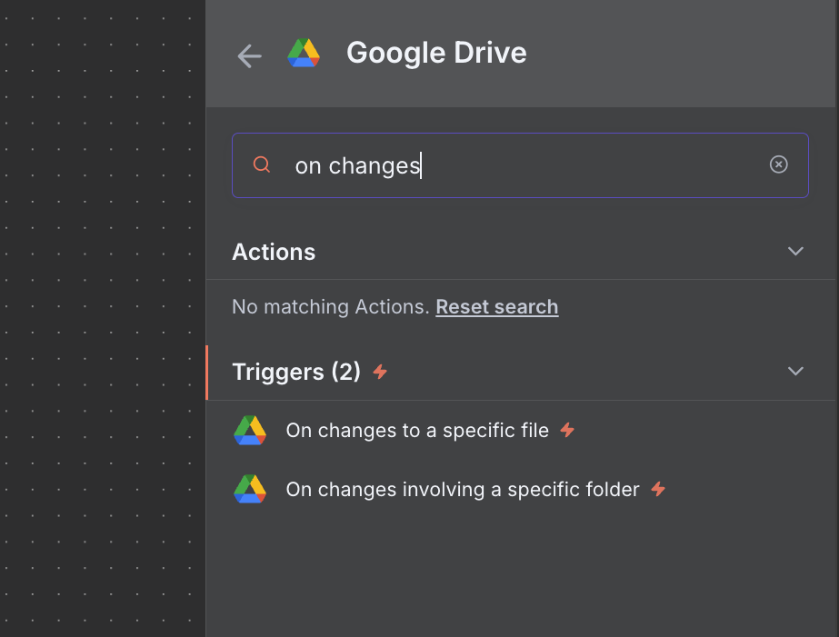

The first step is to decide how n8n will know when your audio file is ready to transcribe. This is your workflow trigger. For this example, we'll use **Google Drive** to automatically trigger the workflow when a new audio file is added to a folder.

1. **Link your Google Drive account** with the credentials you created in the [Credentials](#credentials) step.
2. Add a **Google Drive** trigger node to your workflow
3. Select the trigger event: `On changes involving a specific folder`
4. Configure the trigger parameters:
   - **Credential to connect with:** Select your Gooogle Drive credentials
   - **Poll Times:** Set Mode to Every Minute
   - **Trigger On:** Changes Involving a Specific Folder
   - **Folder:** From list + Select the folder in Google Drive to monitor
   - **Watch For:** File Created

When a new audio file is added to the specified Google Drive folder, the workflow will run.

<Note title="Running the workflow">
  To test the workflow, you can manually trigger it at any time by clicking the orange **Execute Workflow** button in the n8n editor to populate the nodes with sample data.

  For the Google Drive trigger to work as intended, you we will need to deploy this workflow (to n8n cloud) and then add a new audio file to the monitored folder in Google Drive (`/audio_files`). This is handled in a [later step](/docs/integrations/n-8-n#step-8-deploy).
</Note>

For more information on supported audio file types, size limits, and using Google Drive with AssemblyAI see:
- [Can I submit files stored in Google Drive?](/docs/faq/can-i-submit-files-to-the-api-that-are-stored-in-a-google-drive)
- [What Is the Recommended File Type for Using Your API?](/docs/faq/what-is-the-recommended-file-type-for-using-your-api)
- [What types of audio URLs can I use with the API?](/docs/faq/what-types-of-audio-urls-can-i-use-with-the-api)
- [Are there any limits on file size or duration?](/docs/faq/are-there-any-limits-on-file-size-or-file-duration-for-files-submitted-to-the-api)

<Note title="Important Google Drive Considerations">
  For the sake of simplicity, this tutorial uses a public Google Drive link, so you must ensure your file is **100 MB or less** and the Google Drive **folder settings are set to Public** (anyone with the link can view).

  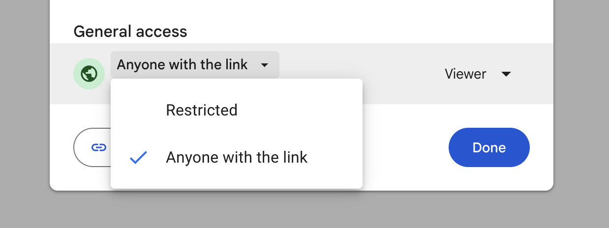

  If you'd like to transcribe private folders/files greater than 100MB, you'll need to add a Google Drive "Download file" node to download the binary data first, then upload it to AssemblyAI using the AssemblyAI "Upload a file" node.
</Note>

</Step>

</Steps>

### Step 2: Upload Audio File (Optional)

After the Google Drive trigger fires, you have the file's `webContentLink` available at `{{ $json.webContentLink }}`.

#### For files under 100MB
You can **skip this step** and use the public Google Drive link directly in [Step 3](/docs/integrations/n-8-n#step-3-submit-transcription-request) without uploading. AssemblyAI accepts [all Google Drive files below 100MB](/docs/faq/can-i-submit-files-to-the-api-that-are-stored-in-a-google-drive).

#### For files over 100MB
Use the **AssemblyAI Upload** node:

1. Add a **Google Drive** "Download File" node and configure it to download the file by ID (you can get the file ID from the trigger response)
2. Add an **AssemblyAI** "Upload a file" node
3. Configure the credential with your [AssemblyAI API key](#prerequisites)
4. The upload will return an `upload_url` to use in the next step

### Step 3: Submit Transcription Request


Now submit the transcription request with your desired features enabled.

<Steps>

<Step title="Add the transcription (create) node">

Using the + sign linked to the Google Drive trigger, add an **AssemblyAI** `Create a transcription` node.

</Step>

<Step title="Configure the node parameters">

- **Credential to connect with**: Select your AssemblyAI Account credential (if you haven't set this up yet, see [Credentials set in n8n](#credentials-set-in-n8n))
- **Resource**: Transcript
- **Operation**: Create
- **Audio URL**: `{{ $json.webContentLink }}`
  - You can also drag and drop the `webContentLink` field from the Google Drive Trigger response into this field

</Step>

<Step title="Enable features">

In **Additional Fields**, enable the following features for this tutorial:
- **Speaker Labels**: `true` (identifies different speakers through diarization)
- **Language Detection**: `true` (automatically detects the language, also known as ALD)

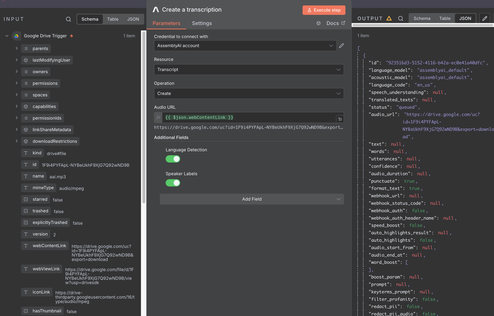

</Step>

</Steps>

You can explore all available features, such as sentiment analysis, entity detection, pii redaction, and more in our [API Reference](/docs/api-reference/transcripts/submit).

The response will contain a `transcript_id` that you'll use to poll for completion.

### Step 4: Poll for Transcription Completion

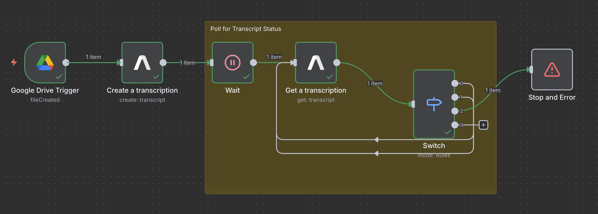

Since transcription is asynchronous, the transcription request returns immediately. You need to poll the API until the transcript is ready.

<Steps>

<Step title="Add a Wait node">

Add a `Wait` node and configure the wait parameters:
- **Resume**: After Time Interval
- **Wait Amount**: 3.00
- **Wait Unit**: Seconds

This will wait 3 seconds before checking the transcript's status.

</Step>

<Step title="Add the transcription (create) node">

Add an **AssemblyAI** `Get a transcription` node after the `Wait` node and configure the node parameters:
- **Credential to connect with**: Select your AssemblyAI Account credential (see [Credentials set in n8n](#credentials-set-in-n8n))
- **Resource**: Transcript
- **Operation**: Get
- **Transcript ID**: `{{ $json.id }}`
  - You can drag and drop the `id` field from the `Create a transcription` response into this field

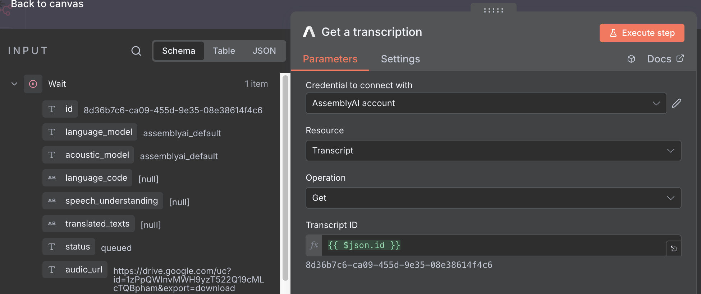

</Step>

<Step title="Add a Switch node">

Add a `Switch` node after the `Get a transcription` node and configure the switch to check the transcript's [status](/docs/api-reference/transcripts/submit#response.body.status):

Add 4 routing rules, each with:
- **Value 1**: `{{ $json.status }}`
  - Or drag the `status` field from the `Get a transcription` response
- **Condition**: "is equal to"
- **Value 2**: Set one of these for each rule:
  1. `queued`
  2. `processing`
  3. `error`
  4. `completed`

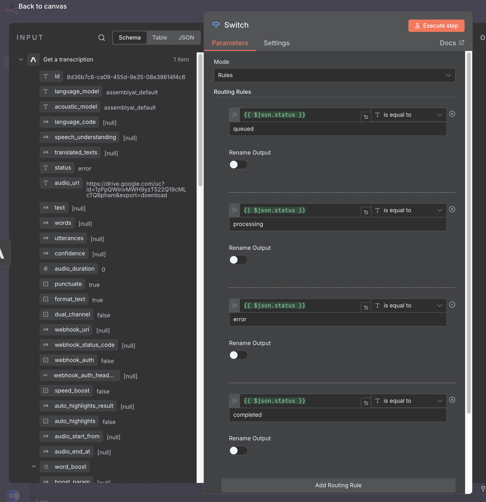

</Step>

<Step title="Handle switch outputs">

Handle each switch node output based on the transcript status:
- **Output 0 (queued)**: Connect back to the **Wait** node to continue polling
- **Output 1 (processing)**: Connect back to the **Wait** node to continue polling
- **Output 2 (error)**: Add a **Stop and Error** node to halt the workflow
  - Note: You may want to add logging or resubmit the transcript instead
- **Output 3 (completed)**: Continue to the next step to process the completed transcript

</Step>

</Steps>

By connecting the `processing` and `queued` outputs back to the `Get a transcription`, you create a polling loop that continues checking (every 3 seconds) until the transcript is complete or encounters an error.

When the transcript is complete, the response will contain the [full transcript data](/docs/api-reference/transcripts/submit#response).


<Note>
  For this tutorial, we are only using the `Create a transcription`, `Get a transcription`, and `Delete a transcription` actions from the AssemblyAI node.
  However, n8n's AssemblyAI integration supports **all available endpoints**, including uploading files, retrieving redacted audio, getting sentences and paragraphs, LLM Gateway, and more.
</Note>

### Step 5: Process Transcript Output into a Human-Readable Transcript

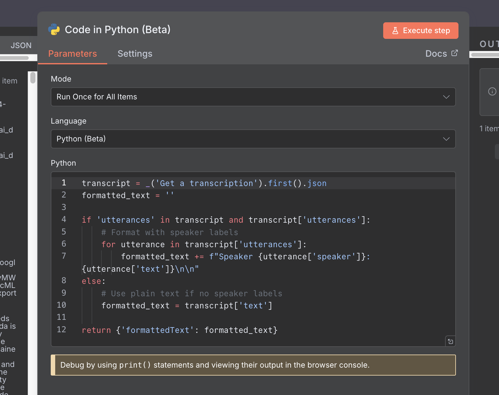

Once you have the completed transcript, we want to manipulate the data into a more usable format.

To pull out the transcript text with speaker labels:

<Steps>

<Step title="Add a Code node (Python)">

Add a `Code` node (Python) to your workflow.

</Step>

<Step title="Use this code to format utterances">

Use this code to format utterances into a readable transcript:

```python
transcript = _('Get a transcription').first().json
formatted_text = ''

if 'utterances' in transcript and transcript['utterances']:
    # Format with speaker labels
    for utterance in transcript['utterances']:
        formatted_text += f"Speaker {utterance['speaker']}: {utterance['text']}\n\n"
else:
    # Use plain text if no speaker labels
    formatted_text = transcript['text']

return {'formattedText': formatted_text}
```

This will output a `formattedText` field containing the transcript with speaker labels.
</Step>

</Steps>

### Step 6: Save to Google Drive

To save the formatted transcript back to Google Drive:

<Steps>

<Step title="Add a Convert to File node">

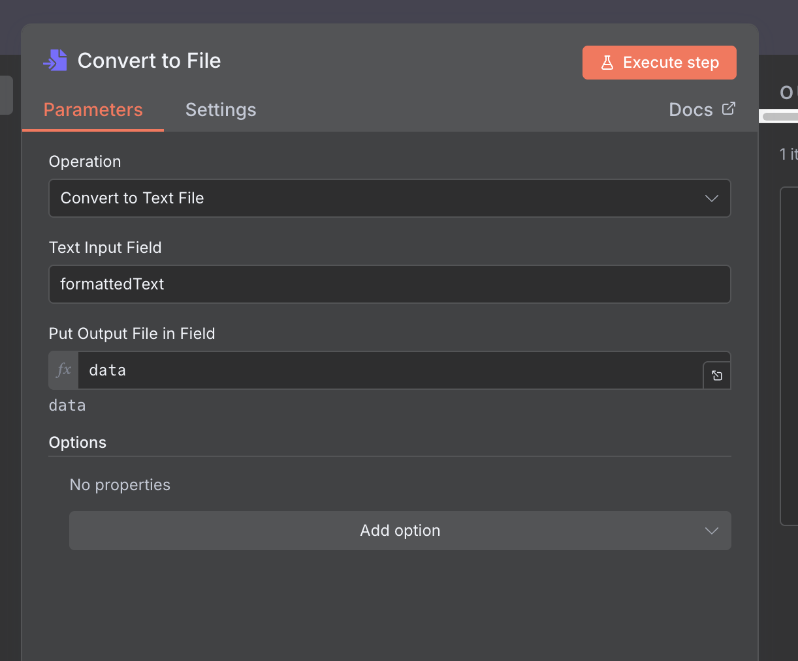

Add a `Convert to File` node and configure it:
- **Operation**: Convert to Text File
- **Text Input Field**: formattedText
- **Put Output File in Field**: data

</Step>

<Step title="Add a Google Drive Upload file node">

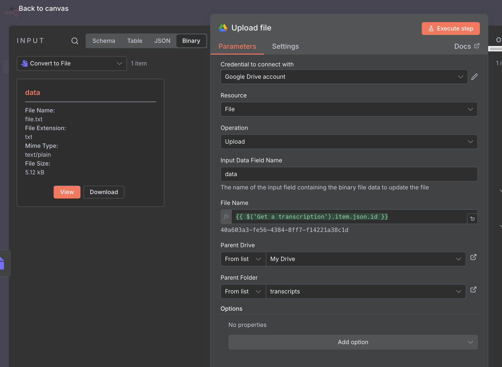

Add a Google Drive `Upload file` node and configure it:
- **Credential to connect with**: Select your Google Drive credential
- **Resource**: File
- **Operation**: Upload
- **Input Data Field Name**: data
- **File Name**: `{{ $('Get a transcription').item.json.id }}` (or drag and drop from input data)
- **Parent Drive**: From list > My Drive
- **Parent Folder**: From list > transcripts

</Step>

</Steps>
The formatted transcript will be saved as a `.txt` file in your specified Google Drive folder:

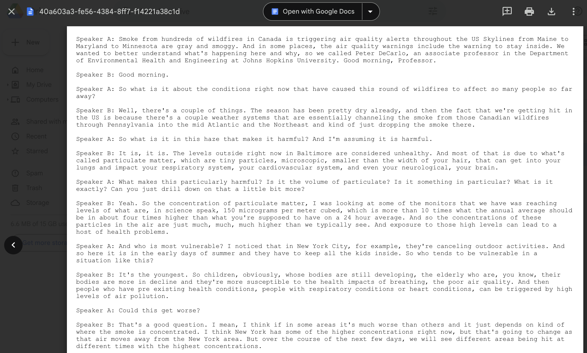

### Step 7: Delete Transcript (Optional)

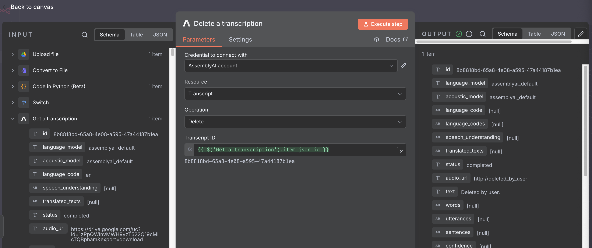

Once you're done processing the transcript, as it is now saved in Google Drive, you can **optionally** delete it from AssemblyAI's servers.

<Steps>

<Step title="Add an AssemblyAI Delete a transcription node">

Add an AssemblyAI `Delete a transcription` node at the end of your workflow.

</Step>

<Step title="Configure the node">

Configure the node parameters:
- **Credential to connect with**: Select your AssemblyAI Account credential
- **Resource**: Transcript
- **Operation**: Delete
- **Transcript ID**: `{{ $('Get a transcription').item.json.id }}`
  - You can drag and drop the `id` field from the `Get a transcription` node response into this field

</Step>

</Steps>
The transcript will be permanently deleted from AssemblyAI's servers.

### Step 8: Deploy

Once the transcript has been deleted, the workflow is complete! At this point, it should look like this:
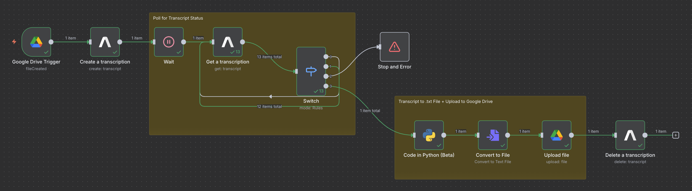

Now you can deploy the workflow to n8n Cloud by navigating back to the n8n Cloud **Overview** page, locating your workflow, and moving the slider icon to the `Active` position.
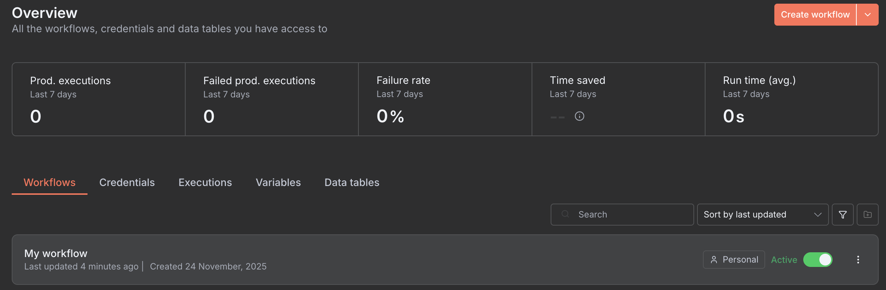

And we're done! Add a file to `/audio_files` in Google Drive, and within a few seconds to a few minutes (depending on the `Poll Times` set for the [Google Drive trigger](/docs/integrations/n-8-n#choose-your-trigger) and the duration of the audio file), you should see the transcript appear in the `/transcripts` Google Drive folder.

## Conclusion

In this tutorial, you built a complete AssemblyAI transcription workflow in n8n that automatically processes audio files from Google Drive, submits them to AssemblyAI for transcription, polls for completion, formats the transcript with speaker labels, saves the output back to Google Drive as a `.txt` file, and finally deletes the transcript from AssemblyAI's servers.

This is just one simple idea, but the possibilities are endless! You can customize this workflow further by adding additional AssemblyAI features and products like sentiment analysis, entity detection, and LLM Gateway (see the **"What can you do with AssemblyAI?"** section of [this page](https://n8n.io/integrations/assemblyai/) for all available actions), or by integrating with other services like Slack, OpenAI, Supabase, Discord, and the hundreds of other [official n8n integrations](https://n8n.io/integrations/).

## Additional Resources
- [AssemblyAI n8n Integration Page](https://n8n.io/integrations/assemblyai/)
- [AssemblyAI n8n Integration GitHub Repo](https://github.com/gsharp-aai/n8n-nodes-assemblyai)

## Need some help?

If you get stuck, think something is broken or missing from our n8n integration, or just have some questions, we'd love to help you out! Contact our support team directly via support@assemblyai.com or open a [support ticket](https://www.assemblyai.com/contact/support).
