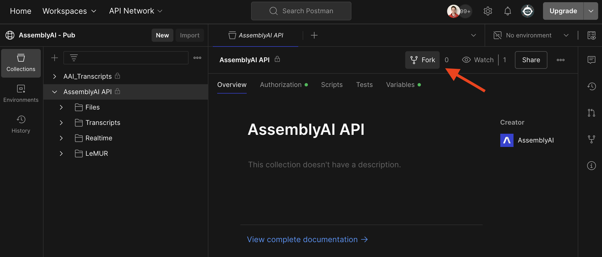
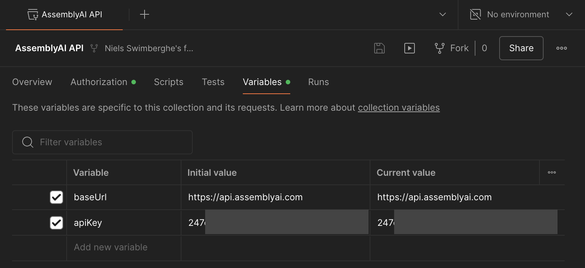
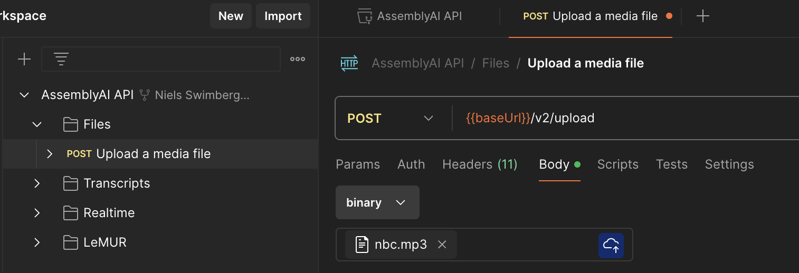
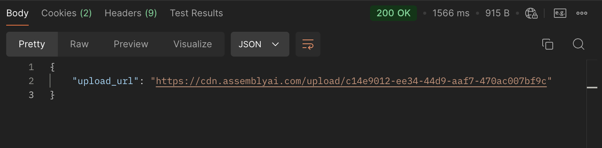
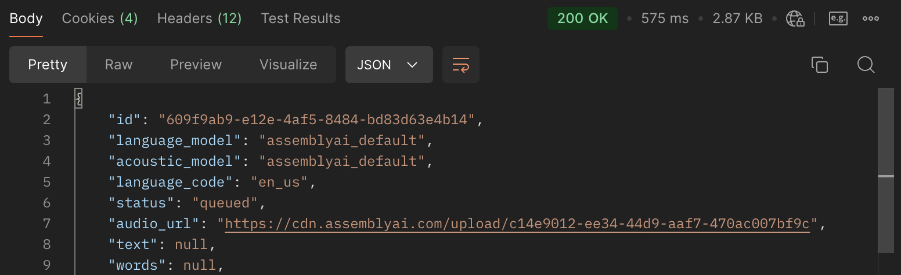
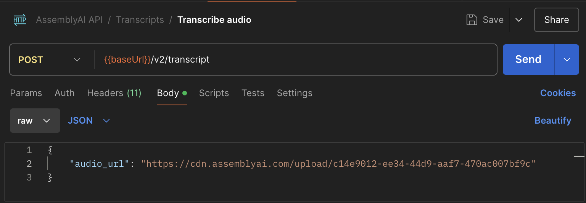
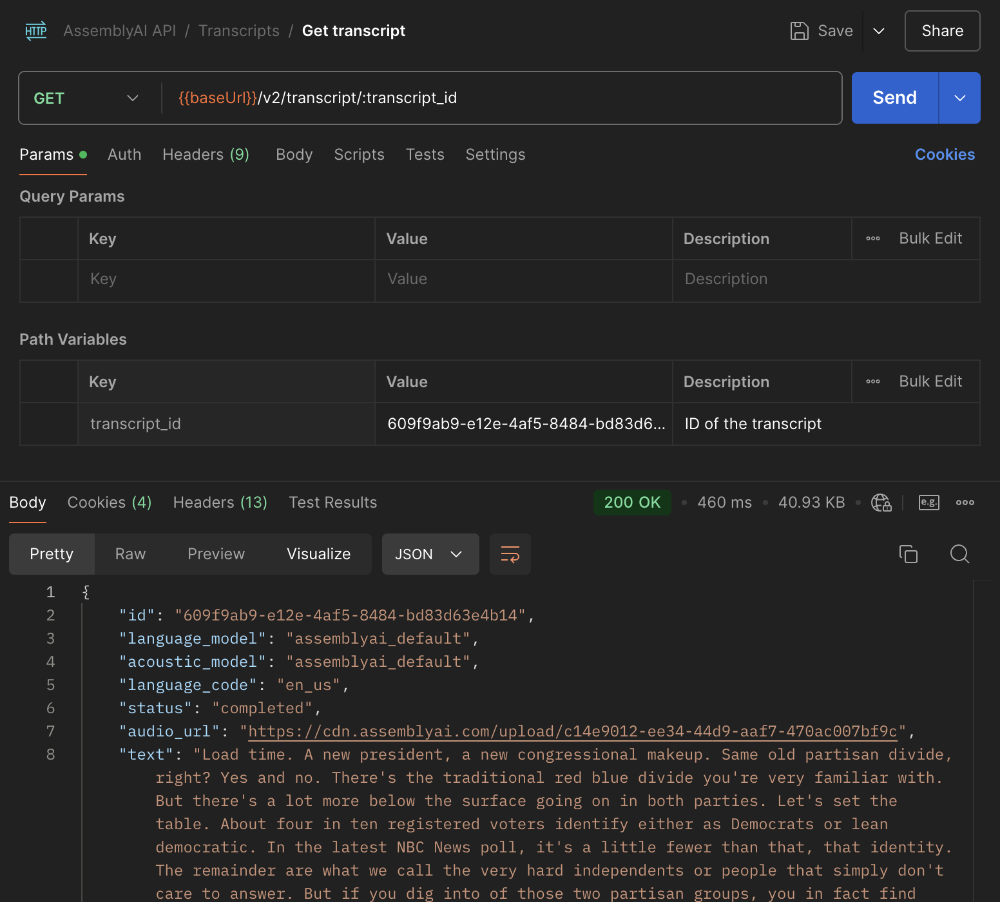
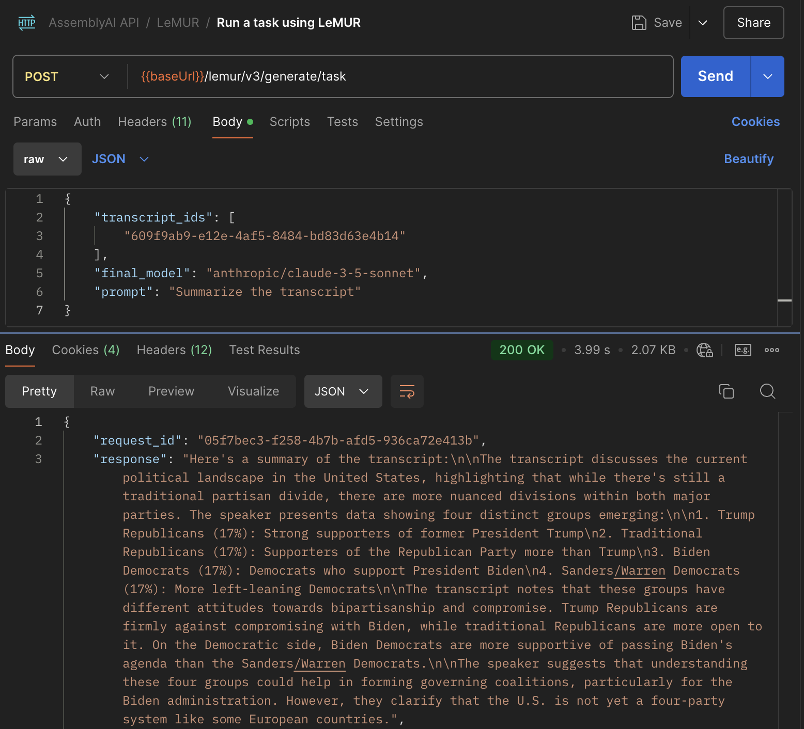

Postman is a user-friendly tool for testing API endpoints. The AssemblyAI API Postman collection contains all the HTTP requests you can make to the AssemblyAI API, so you don't need to write them yourself.

<Card icon="signs-post" title="AssemblyAI API Postman collection" href="https://assembly.ai/postman"/>

## Quickstart

<Steps>
<Step>

Open the [AssemblyAI API collection](https://assembly.ai/postman) in Postman and click the **Fork** button. This will create a copy of the collection that you can edit.

Fill out the form and click **Fork Collection**.

</Step>
<Step>

Next, click on the **Variables** tab and configure the `apiKey` variable with your AssemblyAI API key.
You can find your AssemblyAI API key in the [AssemblyAI dashboard](https://www.assemblyai.com/dashboard/login).

</Step>
<Step>

Let's upload an audio file:
1. Open the **Files > Upload a media file** request
2. Switch to the **Body** tab
3. Change the dropdown from **none** to **binary**
4. Select an audio file of your choosing, or [download this sample audio file](https://assembly.ai/nbc.mp3)
5. Click the **Send** button

Inspect the **Body** of the response and copy the `upload_url` value.

</Step>
<Step>

Now that the audio file is uploaded, you can transcribe the audio file.
1. Open the **Transcripts > Transcribe audio** request
2. Switch to the **Body** tab
3. Find the `audio_url` property and update it to the `upload_url` value from the previous request.
4. Remove all the other properties. Optionally, you can leave any property that you do want to use.
5. Click the **Send** button

Inspect the **Body** of the response and copy the `id` value.

</Step>
<Step>

The transcription job will take longer depending on the duration of the file.
You need to check the `status` property to check if a transcript is ready.
The `status` goes from `queued` to `processing` to `completed`.
The `status` can also become `error` at any point. If an error occurs, you can find the error message under the `error` property.

1. Open the **Transcripts > Get transcript** request
2. Find the `transcript_id` under **Path variables** and update the value with the `id` value from the previous request.
3. Remove all the other properties. Optionally, you can leave any property that you do want to use.
4. Click the **Send** button

Inspect the **Body** of the response to check if the `status` is `completed` or `error`.
If not, resend the request until it is `completed` or `error`.

</Step>
<Step>

Now that you have a completed transcript, you can send these other HTTP requests with your current transcript ID:
* Transcripts
  * Get subtitles for transcript
  * Get sentences in transcript
  * Get paragraphs in transcript
  * Search words in transcript
  * Get redacted audio (if PII audio redaction is enabled)
* LeMUR
  * Run a task using LeMUR
  * Summarize a transcript using LeMUR
  * Ask questions using LeMUR
  * Extract action items

Let's prompt an LLM to summarize the transcript using LeMUR:

1. Open the **LeMUR > Run a task using LeMUR** request
2. Switch to the **Body** tab
3. Find the `transcript_ids` property and replace the sample ID with your transcript ID
4. Set the `final_model` property to ` "anthropic/claude-3-5-sonnet"`
5. Set the `prompt` property to `"Summarize the transcript"`
6. Remove the other properties
7. Click the **Send** button

</Step>
</Steps>

