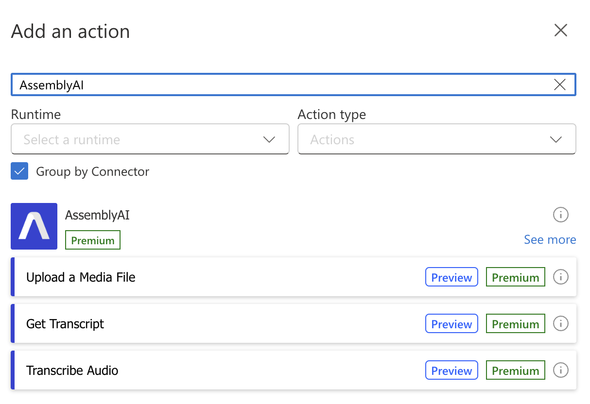
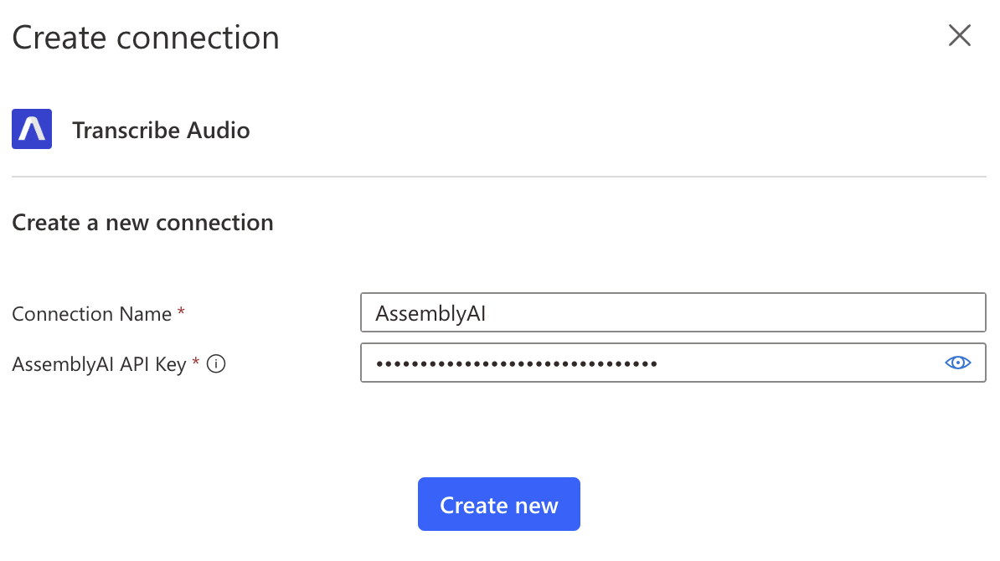
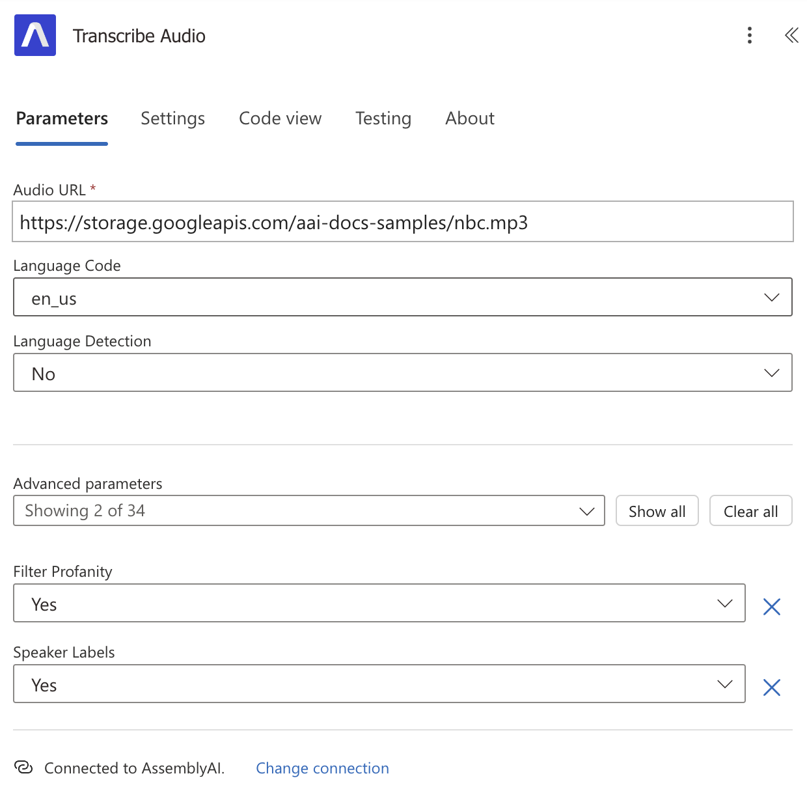

  


[Microsoft Power Automate](https://www.microsoft.com/en-us/power-platform/products/power-automate) is a low-code workflow automation platform with a rich collection of connectors to Microsoft's first-party services and third-party services. [Azure Logic Apps](https://learn.microsoft.com/en-us/azure/logic-apps/logic-apps-overview) is the equivalent service built for developers and IT pros.

The AssemblyAI connector makes our API available to both Microsoft Power Automate and Azure Logic Apps.
With the connector, you can use AssemblyAI to transcribe audio data with speech recognition models, analyze the data with audio intelligence models, and build generative features on top of it with LLMs.
You can supply audio to the AssemblyAI connector and connect the output of our models to other services in your flows.


## Quickstart

<Steps>
<Step>

Create or edit a flow in Power Automate.
Add a new action, search for AssemblyAI, and select the action that you want to use.



</Step>
<Step>

You will be prompted to create a connection to AssemblyAI. Give your connection a name and enter the API key from your [AssemblyAI dashboard](https://www.assemblyai.com/dashboard/login), and click **Create new**.



</Step>
<Step>

Finally, configure your AssemblyAI action. Continue reading to learn more about all the available actions.



</Step>
</Steps>


## Upload a File

To transcribe an audio file using AssemblyAI, the file needs to be accessible to AssemblyAI.
If your audio file is already accessible via a URL, you can use your existing URL.

Otherwise, you can use the `Upload a Media File` action to upload a file to AssemblyAI.
You will get back a URL for your file which can only be used to transcribe using your API key.
Once you transcribe the file, the file will be removed from AssemblyAI's servers.


## Transcribe Audio

To transcribe your audio, configure the `Audio URL` parameter using your audio file URL.
Then, configure the additional parameters to enable more [Speech Recognition](https://www.assemblyai.com/docs/speech-to-text/speech-recognition) features and [Audio Intelligence](https://www.assemblyai.com/docs/audio-intelligence) models.

The result of the Transcribe Audio action is a queued transcript which will start being processed immediately.
To get the completed transcript, you have two options:

1. [Handle the Transcript Ready Webhook](#handle-the-transcript-ready-webhook)
2. [Poll the Transcript Status](#poll-the-transcript-status)

### Handle the Transcript Ready Webhook

If you don't want to handle the webhook using Logic Apps or Power Automate, configure the `Webhook URL` parameter in your `Transcribe Audio` action, and implement your webhook following [AssemblyAI's webhook documentation](https://www.assemblyai.com/docs/getting-started/webhooks#handle-webhook-deliveries).

To handle the webhook using Logic Apps or Power Automate, follow these steps:

<Steps>
<Step>

Create a separate Logic App or Power Automate Flow.

</Step>
<Step>

Configure `When an HTTP request is received` as the trigger:

- Set `Who Can Trigger The Flow?` to `Anyone`
- Set `Request Body JSON Schema` to:
  ```json
  {
    "type": "object",
    "properties": {
      "transcript_id": {
        "type": "string"
      },
      "status": {
        "type": "string"
      }
    }
  }
  ```
- Set `Method` to `POST`

</Step>
<Step>

Add an AssemblyAI `Get Transcript` action, passing in the `transcript_id` from the trigger to the `Transcript ID` parameter.

</Step>
<Step>

Before doing anything else, you should check whether the `Status` is `completed` or `error`.
Add a `Condition` action that checks if the `Status` from the `Get Transcript` output is `error`:

- In the `True` branch, add a `Terminate` action
  - Set the `Status` to `Failed`
  - Set the `Code` to `Transcript Error`
  - Pass the `Error` from the `Get Transcript` output to the `Message` parameter.
- You can leave the `False` branch empty.

Now you can add any action after the `Condition` knowing the transcript status is `completed`,
and you can retrieve any of the output properties of the `Get Transcript` action.

</Step>
<Step>

Save your Logic App or Flow. The `HTTP URL` will be generated for the `When an HTTP request is received` trigger.
Copy the `HTTP URL` and head back to your original Logic App or Flow.

</Step>
<Step>

In your original Logic App or Flow, update the `Transcribe Audio` action.
Paste the `HTTP URL` you copied previously into the `Webhook URL` parameter, and save.

</Step>
</Steps>

When the transcript status becomes `completed` or `error`, AssemblyAI will send an HTTP POST request to the webhook URL,
which will be handled by your other Logic App or Flow.

As an alternative to using the webhook, you can poll the transcript status as explained in the next section.

### Poll the Transcript Status

You can poll the transcript status using the following steps:

<Steps>
<Step>

Add an `Initialize variable` action
- Set `Name` to `transcript_status`
- Set `Type` to `String`
- Store the `Status` from the `Transcribe Audio` output into the `Value` parameter

</Step>
<Step>

Add a `Do until` action

- Configure the `Loop Until` parameter with the following Fx code:
  ```plaintext
  or(equals(variables('transcript_status'), 'completed'), equals(variables('transcript_status'), 'error'))
  ```
  This code checks whether the `transcript_status` variable is `completed` or `error`.
- Configure the `Count` parameter to `86400`
- Configure the `Timeout` parameter to `PT24H`

Inside the `Do until` action, add the following actions:

- Add a `Delay` action that waits for one second
- Add a `Get Transcript` action and pass the `ID` from the `Transcribe Audio` output to the `Transcript ID` parameter
- Add a `Set variable` action
  - Set `Name` to `transcript_status`
  - Pass the `Status` of the `Get Transcript` output to the `Value` parameter

The `Do until` loop will continue until the transcript is completed, or an error occurred.

</Step>
<Step>

Add another `Get Transcript` action, like before, but add it after the `Do until` loop so its output becomes available outside the scope of the `Do until` action.

</Step>
<Step>

Before doing anything else, you should check whether the transcript `Status` is `completed` or `error`.
Add a `Condition` action that checks if the `transcript_status` is `error`:

- In the `True` branch, add a `Terminate` action
  - Set `Status` to `Failed`
  - Set `Code` to `Transcript Error`
  - Pass the `Error` from the `Get Transcript` output to the `Message` parameter.
- You can leave the `False` branch empty.

</Step>
</Steps>

Now you can add any action after the `Condition` knowing the transcript status is `completed`,
and you can retrieve any of the output properties of the `Get Transcript` action.


## Connector actions

The AssemblyAI app for Power Automate provides the following actions:

### Files

#### Upload a Media File

Upload a media file to AssemblyAI's servers.
You can pass the `Upload URL` output field to the `Audio URL` input field of [Transcribe an Audio File](#transcribe-audio) action.

### Transcripts

#### Transcribe Audio

Create a transcript from a media file that is accessible via a URL.
Configure the `Audio URL` field with the URL of the audio file you want to transcribe.
The `Audio URL` must be accessible by AssemblyAI's servers.
If you don't have a publicly accessible URL, you can use the [Upload a File](#upload-a-file) action to upload the audio file to AssemblyAI.

<Warning title="Wait until transcript is ready">

The output of this action is a `queued` transcript. Learn [how to wait until the transcript is ready here](#transcribe-audio).

</Warning>

<Info>
Configure your desired [Audio Intelligence models](/audio-intelligence) when you create the transcript.
The results of the models will be included in the transcript output when the transcript is completed.
</Info>

#### Get Transcript

Get the transcript resource. The transcript is ready when the `status` is `completed`.

#### Get Paragraphs in Transcript

Get the transcript split by paragraphs. The API semantically segments your transcript into paragraphs to create more reader-friendly transcripts.

<Note>
You can only invoke this action after the transcript is completed.
</Note>

#### Get Sentences in Transcript

Get the transcript split by sentences. The API semantically segments the transcript into sentences to create more reader-friendly transcripts.

<Note>
You can only invoke this action after the transcript is completed.
</Note>

#### Get Subtitles for Transcript

Get the transcript resource. The transcript is ready when the `status` is `completed`.

<Note>
You can only invoke this action after the transcript is completed.
</Note>

#### Get Redacted Audio

First, you need to configure PII audio redaction using these fields when you create the transcript:
- `Redact PII`: `Yes`
- `Redact PII Audio`: `Yes`
- `Redact PII Policies`: Configure at least one PII policy

Then, you can use this action to retrieve the redacted audio of the transcript.

<Note>
You can only invoke this action after the transcript is completed.
</Note>

#### Search Words in Transcript

Search through the transcript for keywords. You can search for individual words, numbers, or phrases containing up to five words or numbers.

<Note>
You can only invoke this action after the transcript is completed.
</Note>

#### List Transcripts

Get the transcript resource. The transcript is ready when the `status` is `completed`.

#### Delete Transcript

Delete the transcript. Deleting does not delete the resource itself, but removes the data from the resource and marks it as deleted.

<Note>
You can only invoke this action after the transcript status is `completed` or `error`.
</Note>

### LeMUR

#### Run a Task Using LeMUR

Use the LeMUR task endpoint to input your own LLM prompt.
You have to configure either the `Transcript IDs` or `Input Text` input field.

#### Retrieve LeMUR Response

Retrieve a LeMUR response that was previously generated.

#### Purge LeMUR Request Data

Delete the data for a previously submitted LeMUR request. The LLM response data, as well as any context provided in the original request will be removed.


## Additional resources

You can learn more about using Power Automate with AssemblyAI in these resources:

- [Redact PII in Audio with Power Automate and AssemblyAI](https://www.assemblyai.com/blog/redact-pii-audio-with-power-automate/)
- [Power Automate & Logic Apps docs by Microsoft](https://learn.microsoft.com/en-us/connectors/assemblyai/)


