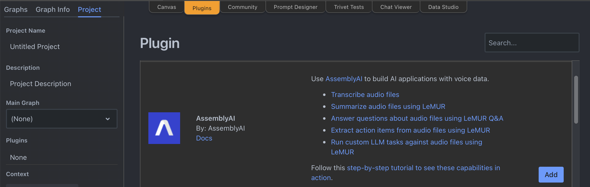
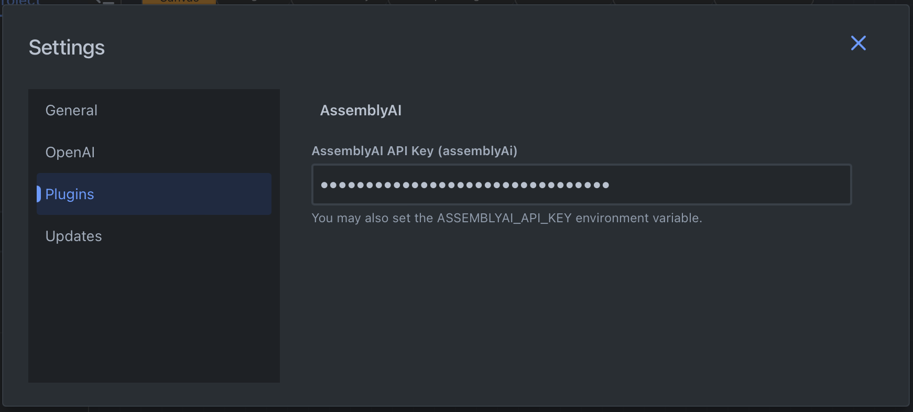
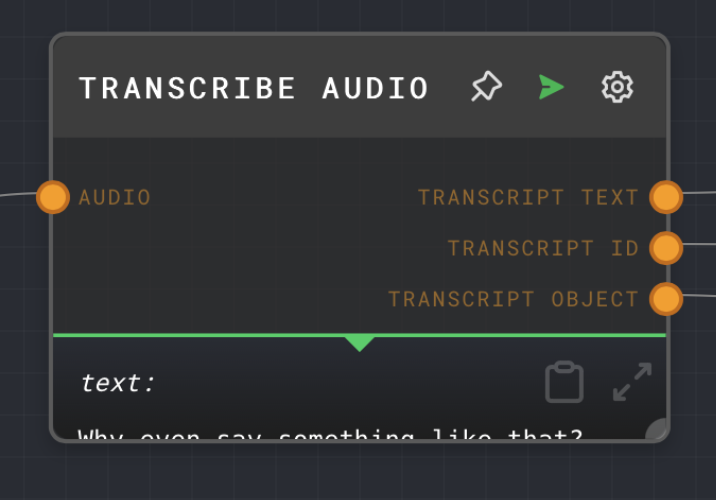

[Rivet](https://rivet.ironcladapp.com/) is an open-source visual AI programming environment.
Through a collaboration between AssemblyAI and Rivet, you can use AssemblyAI speech-to-text capabilities in Rivet.

## Quickstart

<Steps>
<Step>
In your Rivet project, switch to the **Plugins** tab, find the AssemblyAI plugin and click **Add**.

</Step>
<Step>

Next, swap back to the **Canvas** tab, click the three-dotted button, and then click **Settings** in the context menu.
In the **Settings** dialog, switch to the **Plugins** tab, and enter your AssemblyAI API key in the **AssemblyAI API Key** field.

</Step>
<Step>

Now you can add AssemblyAI nodes to your canvas by right-clicking on the canvas, and select any of the nodes under the **AssemblyAI** category.

</Step>
</Steps>

## Nodes

### Transcribe Audio node

The Transcribe Audio node transcribes audio using the [AssemblyAI API](https://www.assemblyai.com/docs/api-reference/overview) . It will return a transcript of the given audio source.

## Additional resources

You can learn more about using Rivet with AssemblyAI in these resources:

- [Build a podcast question & answer application using Rivet and AssemblyAI](https://www.assemblyai.com/blog/podcast-qa-application-rivet/)
- [Rivet](https://rivet.ironcladapp.com/)
- [Rivet Docs](https://rivet.ironcladapp.com/docs)
- [Rivet AssemblyAI Docs](https://rivet.ironcladapp.com/docs/user-guide/plugins/built-in/assemblyai)
- [Rivet GitHub repository](https://github.com/ironclad/rivet)
