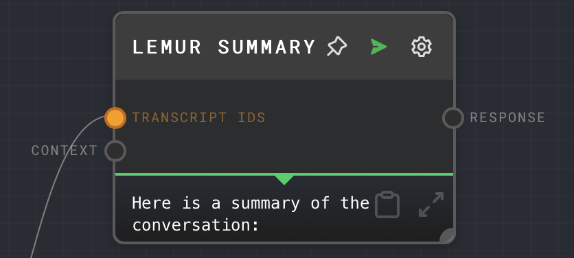
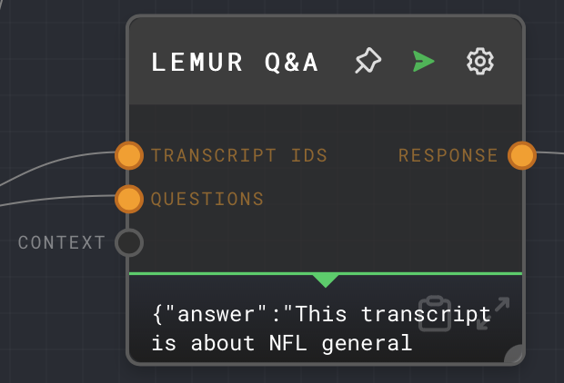
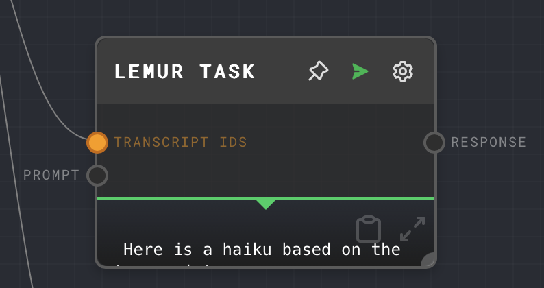
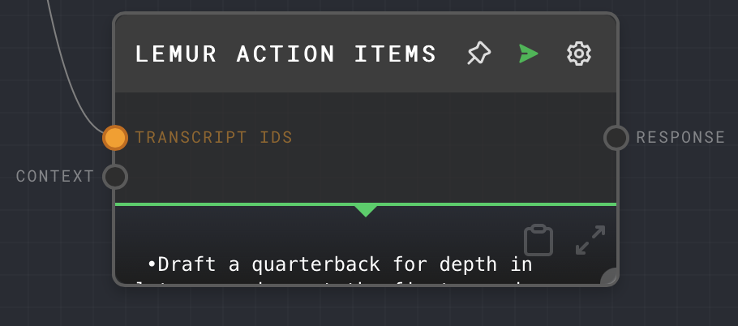

[Rivet](https://rivet.ironcladapp.com/) is an open-source visual AI programming environment.
Through a collaboration between AssemblyAI and Rivet, you can use AssemblyAI speech-to-text and LeMUR capabilities in Rivet.

## Quickstart

<Steps>
<Step>
In your Rivet project, switch to the **Plugins** tab, find the AssemblyAI plugin and click **Add**.

</Step>
<Step>

Next, swap back to the **Canvas** tab, click the three-dotted button, and then click **Settings** in the context menu.
In the **Settings** dialog, switch to the **Plugins** tab, and enter your AssemblyAI API key in the **AssemblyAI API Key** field.

</Step>
<Step>

Now you can add AssemblyAI nodes to your canvas by right-clicking on the canvas, and select any of the nodes under the **AssemblyAI** category.

</Step>
</Steps>

## Nodes

### Transcribe Audio node

The Transcribe Audio node transcribes audio using the [AssemblyAI API](https://www.assemblyai.com/docs/api-reference/overview) . It will return a transcript of the given audio source.

### LeMUR nodes

LeMUR is a framework by AssemblyAI to process audio files with an LLM.
The AssemblyAI plugin has a dedicated node for each LeMUR endpoint.
Each node accepts Transcript IDs or Input Text as input which you can get from the Transcribe Audio node. Additional parameters are available as inputs and as node configuration. For more information what these parameters do, see [LeMUR API reference](https://www.assemblyai.com/docs/api-reference/lemur).

#### LeMUR Summary node

The LeMUR Summary node uses LeMUR to summarize a given transcript.

#### LeMUR Q&A node

LeMUR can generate answers from a transcript and questions.

#### LeMUR Custom Task node

LeMUR can generate a response from a prompt and transcript.

#### LeMUR Action Items node

The LeMUR Action Items node returns a list of action items from a meeting transcript.

## Additional resources

You can learn more about using Rivet with AssemblyAI in these resources:

- [Build a podcast question & answer application using Rivet and AssemblyAI](https://www.assemblyai.com/blog/podcast-qa-application-rivet/)
- [Rivet](https://rivet.ironcladapp.com/)
- [Rivet Docs](https://rivet.ironcladapp.com/docs)
- [Rivet AssemblyAI Docs](https://rivet.ironcladapp.com/docs/user-guide/plugins/built-in/assemblyai)
- [Rivet GitHub repository](https://github.com/ironclad/rivet)
