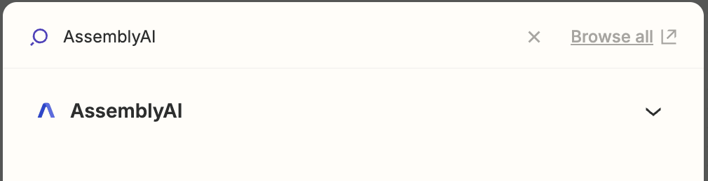
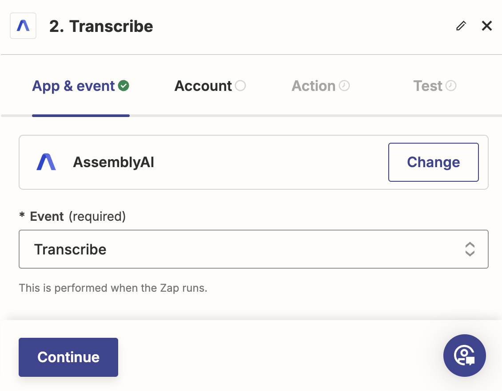
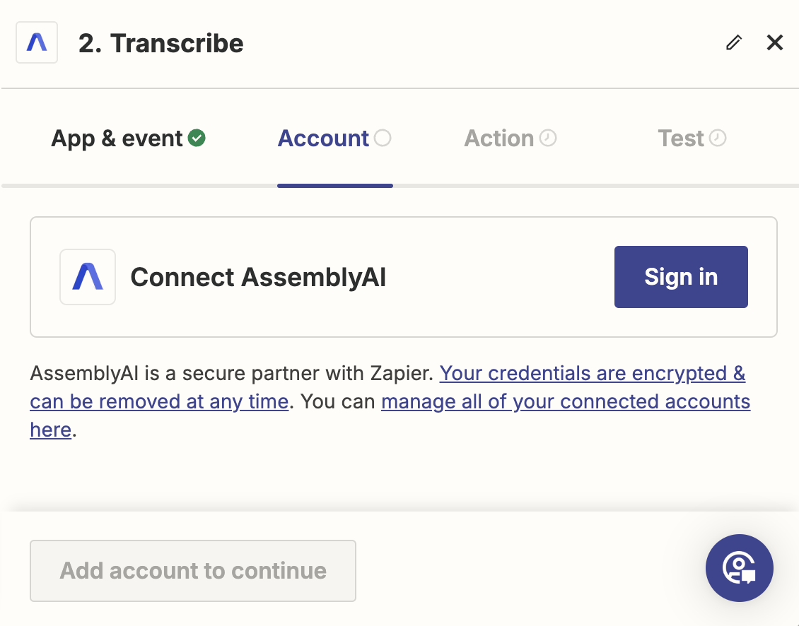
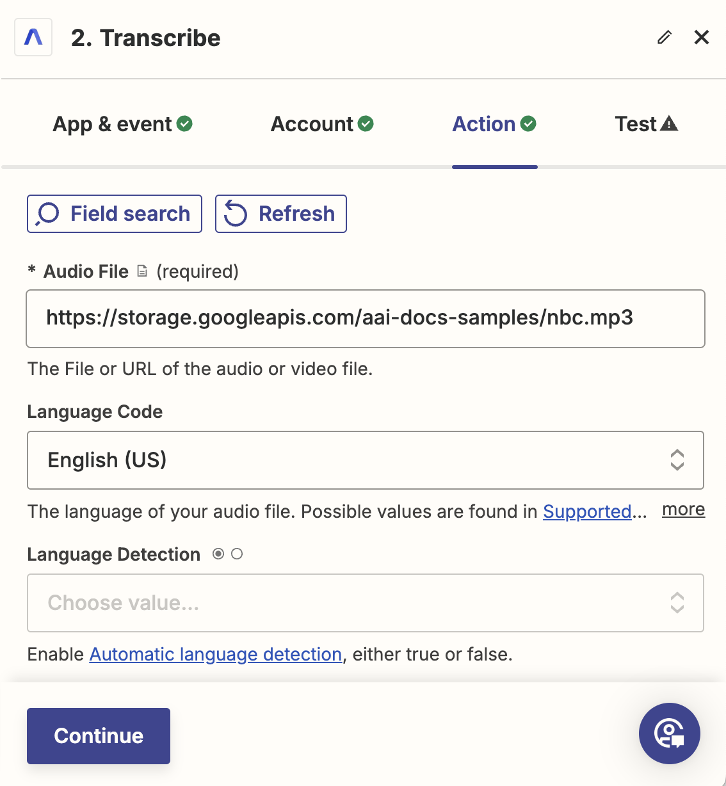
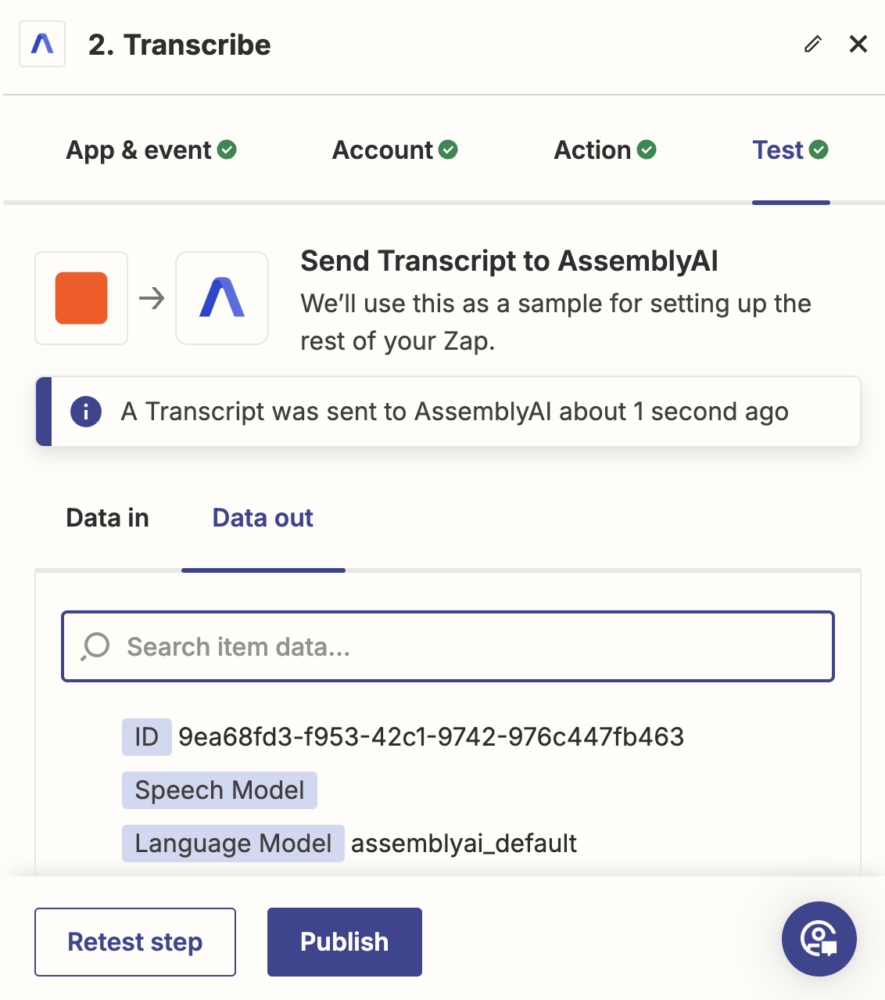

Zapier is a workflow automation tool that lets you integrate various services together without requiring coding knowledge.
You can use our AI models to process audio data by transcribing it with speech recognition models and analyzing it with speech understanding models.
You can supply audio to the AssemblyAI app and connect the output of our models to other services in your Zaps.

## Quickstart

<Steps>
<Step>
In your Zap editor, add an action, search for `AssemblyAI` and select the AssemblyAI app.

</Step>

<Step>
Next, configure the action.
In the **App & event** tab, select **Transcribe** for the **Event** dropdown, then click **Continue**.

</Step>

<Step>
Then, in the **Account** tab, click **Sign in** which will open a separate window.
In the window, enter your AssemblyAI API key in **API Key** field, and click **Yes, Continue to AssemblyAI**.
Back in the Zap editor, click **Continue**.

</Step>

<Step>
In the **Action** tab, enter the URL of the audio or video file you want to transcribe in the **Audio URL** field.
The URL has to be publicly accessible. Click **Continue**.

</Step>

<Step>
Finally, you can test the action. You can use all the fields returned by the action in subsequent steps.

<Note>
  All AssemblyAI actions return sample data during testing instead of running
  the action. This makes it easier to build your Zaps, however, you have to test
  using normal Zap runs to verify everything is working correctly. Learn more
  about why we [return sample data during testing
  below](#testing-with-sample-data).
</Note>

</Step>
</Steps>

## Zapier Actions

### Transcribe

Transcribe an audio file and wait until the transcript has completed or failed.
Configure the `Audio URL` field with the URL of the audio file you want to transcribe.
The `Audio URL` must be accessible by AssemblyAI's servers.

If you don't want to wait until the transcript is ready, change the `Wait until Transcript is Ready` parameter to `False`.

### Get Transcript

Retrieves a transcript by its ID.

### Get Transcript Subtitles

Export the transcript as SRT or VTT subtitles.

<Note>You can only invoke this action after the transcript is completed.</Note>

### Get Transcript Sentences

Retrieve the sentences of the transcript by its ID.

<Note>You can only invoke this action after the transcript is completed.</Note>

### Get Transcript Paragraphs

Retrieve the paragraphs of the transcript by its ID.

<Note>You can only invoke this action after the transcript is completed.</Note>

### Get Transcript Redacted Audio Result

Get the result of the redacted audio model.

<Note>You can only invoke this action after the transcript is completed.</Note>

## Testing with sample data

A transcript goes through multiple phases to transcribe audio, reflected by different statuses.
The initial status is `queued`, immediately followed by `processing`, and the final status is either `completed` or `error`.
**During a normal Zap run**, the Transcribe event will wait until the transcript status is `completed`, and throw an error if the status is `error`.
Unfortunately, this is not the case during testing.

Because of a Zapier platform limitation, **during testing**, the Transcribe event will return a transcript with the `queued` status.
A transcript that does not have the `completed` status cannot be used in subsequent tests.

This way you can easily test using sample data, but you still have to use normal Zap runs to verify the end-to-end functionality.

## Additional resources

You can learn more about using Zapier with AssemblyAI in these resources:

- [How to generate subtitles for your videos using the AssemblyAI app for Zapier](https://www.assemblyai.com/blog/generate-subtitles-with-zapier)
- [How to get started with AssemblyAI on Zapier](https://help.zapier.com/hc/en-us/articles/16411509681933-How-to-get-started-with-AssemblyAI-on-Zapier)
- [AssemblyAI app on Zapier](https://zapier.com/apps/assemblyai/integrations)
