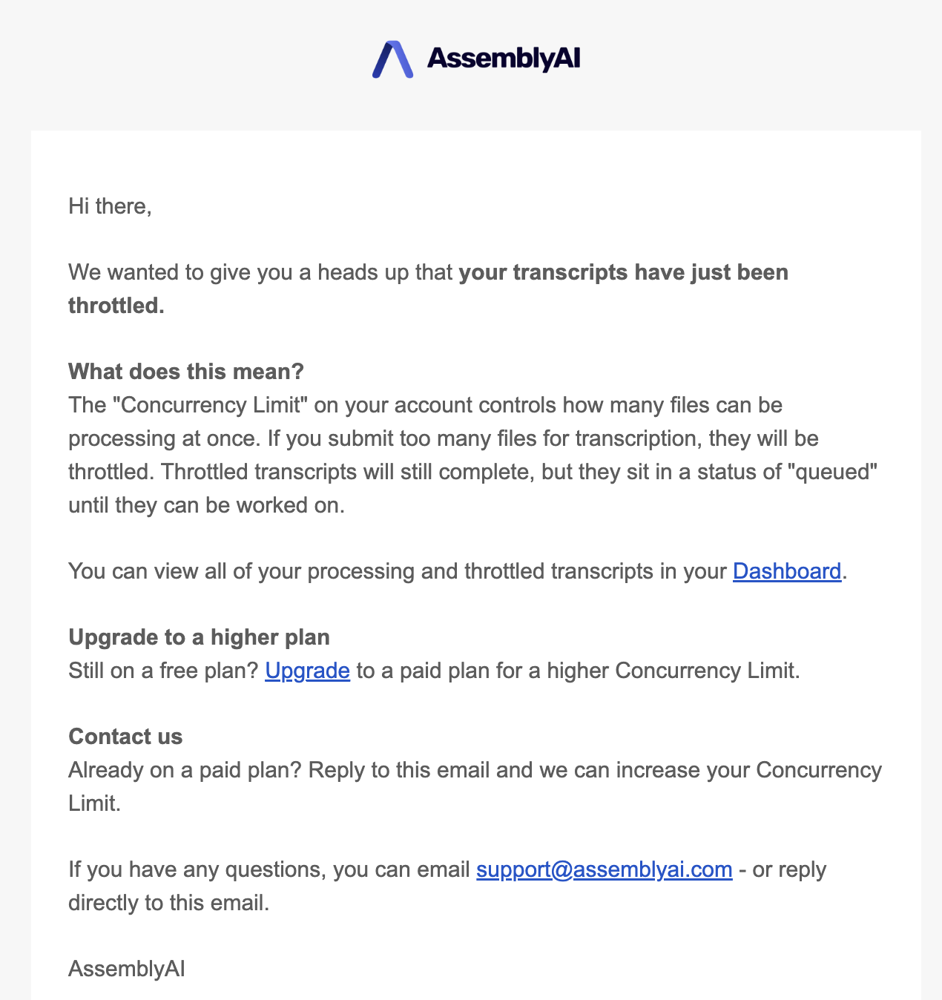

On the [AssemblyAI dashboard](https://www.assemblyai.com/app), you can manage your projects and API keys, and see a breakdown of your usage and spend.

## Projects
Projects can be used to isolate data for different environments or applications, e.g., production, staging, or development. Each project has its own API keys, allowing for better organization and data access control.

Transcripts and other project-specific data is accessible only within the project they were created in — An API key from one project will not be able to access historical transcripts or data from another project. This separation maintains data security and prevents unintended cross-project access.

You can create, rename, and delete projects based on your plan:

| Usage limits | Free | PAYG | Enterprise |
|--------------|------|------|------------|
| Number of projects | 2 | 2 | Custom |

## API Keys
API keys are unique credentials that authenticate requests to the API. Each API key is associated with a specific project, ensuring secure and controlled access.

You can create and delete API keys based on your plan:

| Usage limits | Free | PAYG | Enterprise |
|--------------|------|------|------------|
| Number of API keys | 2 | 4 | Custom |

### Create a new API Key
1. Log in to your [AssemblyAI Dashboard](https://www.assemblyai.com/dashboard)
2. Navigate to the "API Keys" section
3. Click the "Create New API Key" button
4. Enter a descriptive name for your API key (e.g., "Production API", "Development API")
5. Click "Create"

### Delete an API Key
1. Log in to your [AssemblyAI Dashboard](https://www.assemblyai.com/dashboard)
2. Navigate to the "API Keys" section
3. Locate the API key you want to delete
4. Click the "Delete" button next to the key
5. Confirm the deletion in the popup dialog

<Error>
This action cannot be undone. Make sure no active applications are using the key before deletion.
</Error>

## Reporting
Get insights into your usage and spend to track and manage costs effectively with the reporting tool in the AssemblyAI dashboard. You can analyze your usage and spend data at different levels of granularity:
- Account
- Product (e.g., Speech-to-text, Streaming, LeMUR)
- Models (e.g., Best, Nano, Claude 3.5 Sonnet, etc.)
- Project
- API key

## Usage Limits

<Note>
With the current version of multi-project support, rate limiting is applied at the account level, not at the project level. This means that usage limits are shared across all projects within your account.
</Note>

To ensure a smooth experience for all users, certain operations have per-account usage limits.

- **Concurrency limits** for asynchronous operations
- **Rate limits** for synchronous operations

<Note title="Increasing your usage limits">
The usage limits displayed on this page are default values based on your account type. If you already have a paid account and want to further increase your usage limits, <a href="https://www.assemblyai.com/contact" target="_blank">contact our Sales team</a> or send an email to our [Support team](support@assemblyai.com).
</Note>

### Speech-to-Text usage limits

AssemblyAI limits the number of transcriptions being processed at any given time.

| Usage limit | Free account | Paid account |
| --- | --- | --- |
| Concurrent transcriptions | 5 | 200 |

If you submit a transcription that would exceed your usage limit, it'll be added to a queue. Queued transcriptions will be processed automatically as previously submitted transcriptions complete.

If your account balance goes below zero, your concurrency limit will be reduced to 1.

If you exceed your concurrency limit, you'll receive an email stating that your transcripts have been throttled. Note that you'll only receive this email once per day.

### Streaming Speech-to-Text usage limits

AssemblyAI limits the number of concurrent sessions.
  
| Usage limit | Free account | Paid account |
| --- | --- | --- |
| Concurrent Streaming sessions | N/A* | 100 |

\* Streaming Speech-to-Text is only available for paid users.

<Note title="Properly terminating sessions">
If you're consistently exceeding the limit of concurrent sessions, first make sure that you're terminating sessions properly.

- If you're using the [WebSocket API](https://www.assemblyai.com/docs/api-reference/streaming/realtime) directly, you need to send a `terminate_session` message.
- If you're using one of our SDKs, see "Transcribe streaming audio from a microphone" for [Python](/docs/getting-started/transcribe-streaming-audio-from-a-microphone/python#step-6-close-the-connection), [TypeScript](/docs/getting-started/transcribe-streaming-audio-from-a-microphone/typescript#step-6-disconnect-the-real-time-service), [Go](/docs/getting-started/transcribe-streaming-audio-from-a-microphone/go#step-5-disconnect-the-transcriber), [C#](/docs/getting-started/transcribe-streaming-audio-from-a-microphone/c#step-6-disconnect-the-real-time-service), or [Java](/docs/getting-started/transcribe-streaming-audio-from-a-microphone/java).
</Note>

### LeMUR usage limits

LeMUR requests are rate limited within a 60-second time window. For more information, see [Rate limits](https://www.assemblyai.com/docs/api-reference/overview#rate-limits).

| Usage limit | Free account | Paid account |
| --- | --- | --- |
| Requests per minute | N/A* | 30 |

\* LeMUR is only available for paid users.

## Best Practices
- Use different API keys for development and production environments
- Monitor usage and spend patterns for each API key in your dashboard
- Keep your API keys secure and never expose them in client-side code
- Use meaningful names and tags to easily identify the purpose of each key
- Store API keys as environment variables in your application
