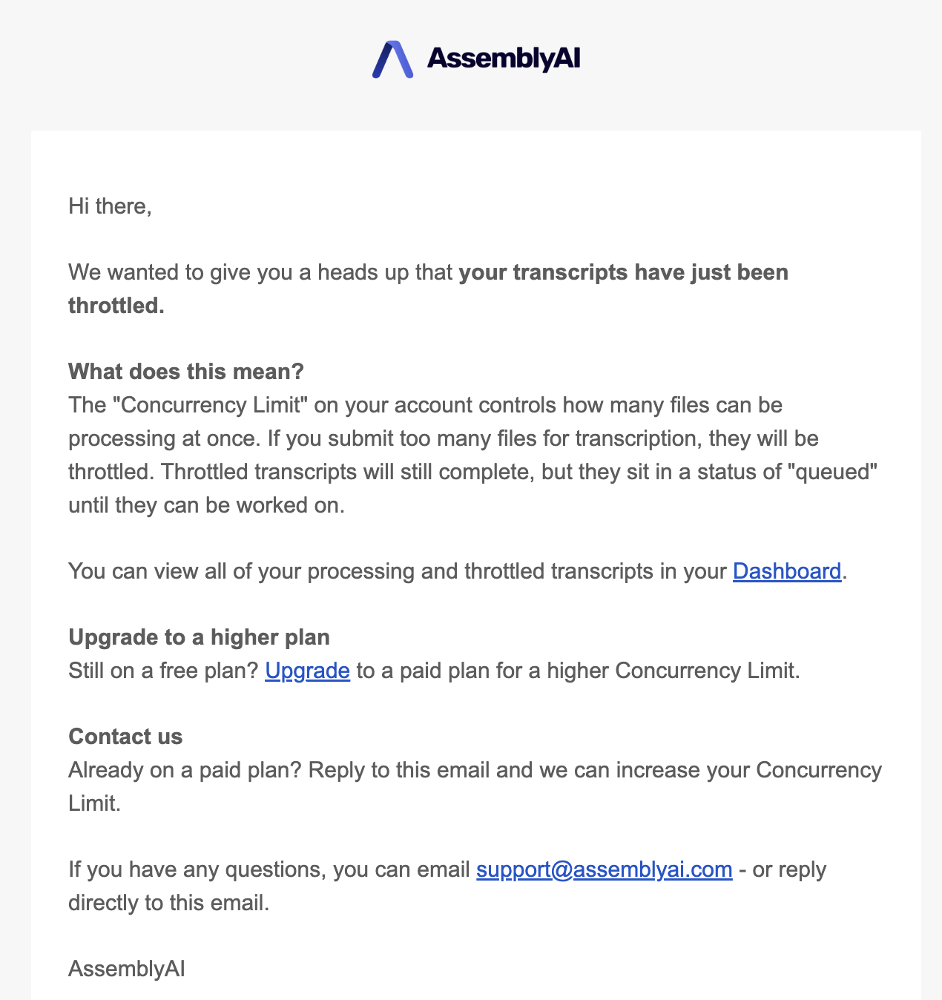

When you submit audio files to the `/v2/transcript` endpoint, AssemblyAI processes them concurrently up to your account's concurrency limit. The concurrency limit is the maximum number of transcription jobs that can be actively processing at the same time.

## Default limits

| Account type | Concurrent transcriptions |
| ------------ | ------------------------- |
| Free         | 5                         |
| Paid         | 200+                      |

<Note title="Need a higher concurrency?">

Our services are infinitely scalable and we offer custom concurrency limits that scale to support any workload at no additional cost. If you need a higher concurrency limit, please either [contact our Sales team](https://www.assemblyai.com/contact) or send an email to our [Support team](https://www.assemblyai.com/contact/support).

</Note>

## What happens when you hit the limit

If you submit a transcription that would exceed your concurrency limit, it is added to a queue. Queued transcriptions are processed automatically in FIFO (first-in, first-out) order as previously submitted transcriptions complete.

If you exceed your concurrency limit, you will receive an email stating that your transcripts have been throttled. You will only receive this email once per day.

<Note>

If your account balance goes below zero, your concurrency limit will be reduced to 1.

</Note>

## HTTP rate limits

In addition to the concurrency limit, there is a rate limit for the API that restricts accounts to a maximum of 20,000 requests per five minutes.

## Check your limit

You can view your current concurrency limit on the [Rate Limits page](https://www.assemblyai.com/dashboard/rate-limits) of your dashboard.

<Note>

With the current version of multi-project support, rate limiting is applied at the account level, not at the project level. This means that the rate limits for each API key mirror the rate limits for the account.

For example, if an account has a concurrency limit of 200, each API key for that account will be able to process up to 200 requests concurrently.

</Note>

## Related pages

- [Streaming STT Concurrency](/docs/streaming/concurrency)
- [Account Management](/docs/account-management)
- [Transcript status](/docs/pre-recorded-audio/transcript-status)
